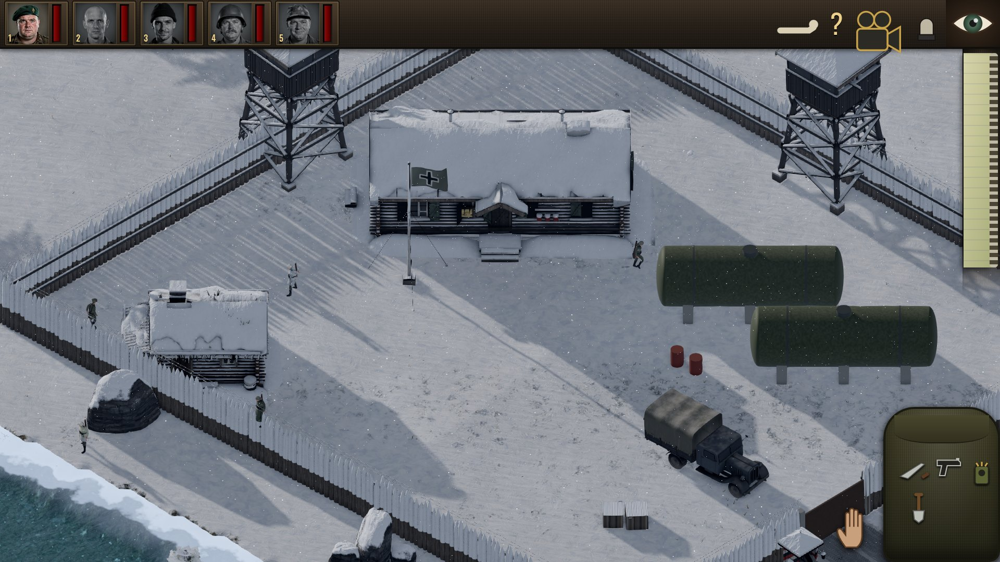
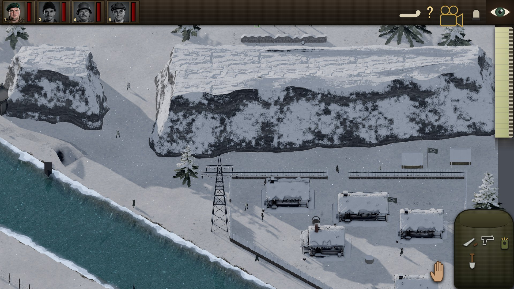
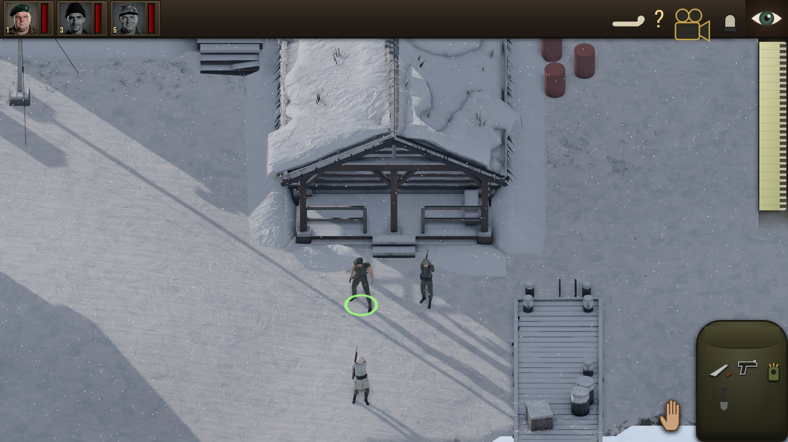

# SHADOW SIX

A browser remake of **Commandos: Behind Enemy Lines** (1998), built on three.js (r186) with physically based
rendering. It is a real-time stealth tactics game: six specialists, enemy vision cones, a fixed 3/4 camera and
missions set in WWII Europe and Africa.

**[Play online: https://jaher.github.io/shadow-six/](https://jaher.github.io/shadow-six/)** (desktop browser
with WebGL 2; the first load of a mission downloads a lot of textures, models and audio, so give it a moment).

> **Disclaimer.** SHADOW SIX is an unofficial, non-commercial fan tribute to *Commandos: Behind Enemy Lines*
> (Pyro Studios / Eidos Interactive, 1998). It is not affiliated with, endorsed by or connected to Pyro Studios,
> Eidos, Square Enix or Kalypso Media. 'Commandos' is a trademark of its owner. No assets from the original
> game are used; all art, audio and code are original or CC0/redistributable (see [CREDITS.md](CREDITS.md)).



| | |
| --- | --- |
|  |  |

## Status

Work in progress.

- **Playable now:** missions 1 to 3 of the *Behind Enemy Lines* campaign, with realistic art: snow terrain,
  water, buildings, vehicles, animated soldiers and commandos, vision cones, alarms, the knapsack, stealth kills,
  carrying bodies, explosives, briefings, debriefings, and saving and loading.
- **Coming later:** missions 4 to 20, the *Beyond the Call of Duty* campaign, and further features and polish.
  They are being built on separate branches and will be published as they are finished.

## Running locally

There is no build step: the repository root is the web root.

```sh
node tools/serve.mjs          # http://localhost:8080/  (or: npm run serve)
node tools/serve.mjs 3000     # another port
```

Any static file server also works, for example `npx serve .` or `python3 -m http.server 8080`. Use a desktop
browser with WebGL 2 (Chrome, Edge or Firefox; a discrete GPU is recommended for the higher presets).

URL parameters:

| Parameter | Effect |
| --- | --- |
| `?mission=m01` | Skip the title screen and load a mission (`m01`–`m03`; `m00` is the sandbox). |
| `?preset=low\|medium\|high\|ultra` | Rendering quality preset. |
| `?test=1` | Test mode: the simulation only advances through `window.__game.advance(s)`. |

## Controls

The controls follow the original game.

| Input | Action |
| --- | --- |
| Left click a commando or portrait, `1`–`6` | Select (Shift adds to the selection); `0` deselects, `8` selects all |
| Left drag | Box select |
| Left click on the ground | Walk there; **double-click** runs |
| Right click | Cancel the armed item, else deselect |
| Click (Shift+click) an enemy | Show its vision cone |
| `C` / `S` | Lie down and crawl / stand up |
| `X` knife, `G` pistol, `R` sniper rifle, `J` harpoon or trap, `B` bomb, `A` detonator, `E` grenade, `L` injection, `W` wire cutters, `K` first aid, `U` uniform, `Q` decoy, `T` boat, `D` diving gear, `F` shovel | Knapsack items (each commando only has his own) |
| `Tab` | Move the knapsack panel to the other side |
| Arrow keys, screen edges, middle drag | Pan the camera |
| Mouse wheel, numpad `+` / `-` (or `=` / `-`) | Zoom; numpad `*` or `Backspace` resets |
| `Home` | Centre on the selection |
| `P`, `Esc` | Pause and objectives, cancel |
| `F1` | Help |
| `F2`–`F7` | Split-screen camera views |
| `F8` / `F9` (`Ctrl+S` / `Ctrl+L`) | Quick save / quick load |
| `Ctrl+B` | Notes |

## Weapons per commando (BEL 1998)

Each commando carries only the equipment he had in the original game; missions add or change counts.

| Commando | Weapons | Tools |
| --- | --- | --- |
| Green Beret | knife, pistol | decoy, shovel |
| Sniper | sniper rifle (limited rounds, 5 by default), pistol | first-aid kit if neither Driver nor Spy is deployed |
| Marine | knife, harpoon gun (unlimited, shorter range than the pistol), pistol | inflatable boat, diving gear |
| Sapper | pistol, bear trap, time bombs **or** remote bombs (never both); grenades per mission | detonator (remote bombs), wire cutters per mission |
| Driver | pistol; submachine gun (20 bursts) only in missions 1, 2, 4 and 10 | first-aid kit (6 doses) |
| Spy | pistol, lethal injection (unlimited) | enemy uniform (found on site); first-aid kit if no Driver |

The data lives in [src/items.js](src/items.js).

## Tests

```sh
node tests/unit/run.mjs      # npm run test:unit: pure simulation (grid, pathfinding, world, objectives, items…)
node tests/run.mjs [pattern] [--swiftshader] [--headed]   # npm test: browser tests in headless Chromium
```

The unit tests run on GitHub Actions for every push and pull request. The browser runner (`npm install` first,
for playwright-core) starts `tools/serve.mjs` on a free port and launches a cached playwright Chromium on the
real GPU (`--use-angle=gl`); `--swiftshader` uses software rendering. It fails on thrown errors, page errors,
`console.error` and HTTP errors. Screenshots go to `tests/out/` (git-ignored).

## Deployment

[`.github/workflows/pages.yml`](.github/workflows/pages.yml) publishes the site to GitHub Pages on every push to
`master`. It copies only the runtime files (`index.html`, `src/`, `styles/`, `vendor/`, `assets/`, `LICENSE`,
`CREDITS.md`) into the Pages artifact. All URLs in the game are relative, so it works under the `/shadow-six/`
sub-path. [`.github/workflows/ci.yml`](.github/workflows/ci.yml) runs the unit tests.

## Layout

```
index.html            entry page (import map → vendor/three.module.js)
styles/               screen, menu and HUD styles
src/main.js           boot: WebGL check → Game → assets → title
src/game.js           Game: states, fixed-step loop, mission loading
src/config.js         gameplay and render numbers
src/items.js          item catalogue and BEL default loadouts
src/core/             events, math, objectives
src/world/            grid (terrain, blocking, line of sight), pathfinding, world, map builder
src/entities/         units, commandos, enemies, vehicles, projectiles, interactables
src/ai/               perception, enemy brain, alarm
src/abilities/        one file per ability
src/engine/           renderer, camera, input, asset loading
src/render/           vision cones, selection markers, effects
src/art/              models, materials, terrain, water, characters
src/ui/, src/audio/   menus, HUD, briefings, credits; audio
src/missions/         mission definitions (m00 sandbox, m01–m03)
assets/               textures, models, HDRIs, audio, portraits, fonts (see CREDITS.md)
vendor/               three.js r186 and addons
tools/                dev server, asset build scripts (Blender, audio, portraits)
tests/                browser tests and unit tests
docs/                 architecture, design spec, research notes, screenshots
```

Read [docs/ARCHITECTURE.md](docs/ARCHITECTURE.md) before changing module interfaces.

## Credits

All third-party material is listed with its source, author and licence in [CREDITS.md](CREDITS.md). In short:

- Code: three.js and its addon libraries (MIT / Apache-2.0).
- Textures, HDRIs and models: CC0 sets from Poly Haven and ambientCG, plus the project's own Blender and
  procedural models.
- Sound: CC0 / public-domain recordings and the project's own synthesis. Fonts: SIL OFL and Apache-2.0.
- Briefing photographs: public-domain wartime photographs (Imperial War Museums, via Wikimedia Commons).
- **AI-generated media.** The commando portraits and their talking animations were generated for this project
  (Z-Image-Turbo, JoyVASA and LivePortrait), and the voices were synthesised (Kokoro and Chatterbox). The faces
  come from written descriptions only; no real person's likeness or voice is used.

The original game, *Commandos: Behind Enemy Lines*, was created by Gonzo Suárez and Pyro Studios and published
by Eidos Interactive in 1998. This project exists out of admiration for it.

## License

The original source code is released under the [MIT License](LICENSE). Assets in `assets/` and the libraries in
`vendor/` keep their own licences; see [CREDITS.md](CREDITS.md) and [vendor/LICENSE](vendor/LICENSE).
