# Clipping / interpenetration audit

User report: *"Be careful with objects crossing other objects, for example turrets crossing a fence."*
This page describes the audit tool built for it, what it found on M1, M2, M3, the m00 sandbox and the b00 BCD sandbox
(e8eea3f, "before"), and the generic placement / clearance rules that fix it ("after"): **zero unintended static or turret
overlaps on all five maps** (31 before) and 175 → 69 → **26** moving penetrations deeper than 5 cm (first fix, then the
second pass on the verifier's findings: see "Second pass") → **0** after the third pass (clip-2), which made the dynamic
run a gate: no live unit or vehicle goes deeper than 5 cm into anything on any of the five maps, for two seeds of the
180 s run. Tanks and armoured cars parked beside every wall, fence and building side of the five maps (the turret probe)
never swing a barrel or turret through them, hulls never sweep a corner into a wall when they turn, and no prop floats
over a slope.

## Tool

| piece | what |
|---|---|
| `src/debug/clip-rules.js` | Pure rules, unit-tested in `tests/unit/clip-rules.test.mjs`: category per structure type (regex table, size fallback), intended contacts, joints, baseline keys and diff |
| `src/debug/clip-geom.js` | Triangle-exact measurement with three-mesh-bvh 0.9.15 (MIT, vendored in `vendor/three-mesh-bvh/`). BVHs are built over Float32 copies of the positions, so game geometry is never touched |
| `src/debug/clip-audit.js` | Collects the scene items and runs the static audit, the turret sweep and the dynamic audit. Test mode: `await __game.clipAudit()` loads it lazily and exposes it as `__game.clip` |
| `tools/audit/clipping.mjs` | CLI (GPU headless via the test harness). Writes `docs/clipping/<mission>.json` and 2×-zoom crops `docs/screenshots/clip-<mission>-{s,t,d}<n>.jpg` (640×400, about 30–50 KB) |
| `tests/clipping.test.mjs` | GPU test (static part about 21 s; the dynamic acceptance runs the five maps in parallel pages for seeds 7 and 11, a few minutes). Dynamic: no live unit or vehicle deeper than 5 cm into anything in 180 s. For all five maps, fails on any unintended static or turret overlap that is not in `tests/clip-baseline.json`. It also checks the detector itself: an MG nest parked 0.7 m from barracks `barr_2` must be caught when its barrel sweeps through the wall (`turrets({raw: true})`), and that rule (d) keeps the same gun's barrel out of the wall in play. Every map must have visual nav blocks stamped, no floating / buried prop, a clean turret probe (≤ 8 cm), and on M2 the wall-walk sentry `e5` shot beside the palisade must lie clear of it |
| `__game.clip.turretProbe()` | Guns the maps don't have yet: a `panzer2` and an `sdkfz` are parked where they could really drive (every hull point passable at ≤ 0.4 m spacing: blocks, visual nav blocks, eaves) as close as possible beside every wall, fence, gate, building, tower, tent and pole side, and their guns swept over their open arcs. The GPU test requires no overlap deeper than 8 cm |
| `__game.clip.floating()` | Rule (b) seating: each prop's flat bottom (vertices within 4 cm of its lowest) against the terrain right under it: a corner more than 5 cm above the ground (hanging over a slope or a dip) or a base buried deeper than 0.5 m. Over water / carved banks is skipped |
| `__game.clip.vehicleBodies()` | Characters (standing, crouched, lying, dead) against vehicle hulls and wrecks, posed now, mesh against mesh (crews and a man run over skipped). The dynamic audit runs it every sample and sends half the commando moves to a spot at, under or across a solid (vehicle hull, wreck, fuel drum, pushable, crate / fuel tank / rock / sandbag body solid) in a random stance; props, drums and pushables are statics of the ordinary character checks |
| `__game.clip.entity(tag)` | One unit or vehicle, posed now, against the statics (probes and tests: a body after its death clip) |
| `__game.clip.fit()` | Rule (c) report: per structure, how far its visual reaches beyond its `w × d` footprint, at the base (< 1 m) and in full (eaves, flags) |
| `tools/audit/clip-shots.mjs` | Before / after crops for this page from `docs/clipping/shots.json` (same framing as the audit's crops, box outlined in green) |

```
node tools/audit/clipping.mjs --mission m01            # static + turrets + 180 s dynamic, 6 crops
node tools/audit/clipping.mjs --seed 11                # the second seed of the dynamic acceptance
node tools/audit/clipping.mjs --dynamic 0              # all 5 maps, static + turrets only (~40 s)
node tools/audit/clipping.mjs --dynamic 0 --write-baseline   # accept the current overlaps
node tests/run.mjs clipping                            # the guard test
```

### What is audited

- **Static items**:
  - every structure's render tree. Library buildings are audited at LOD0. Instanced repeats are split per instance and matched back to their structure id.
  - dressing: walls, rocks, cliffs, tents, sandbags, crates, poles.
  - flags, which are audited as part of their building.
  - vegetation chunks, split into `trunk` and `foliage`. Each is reported under the nearest tree id, e.g. `pine#19~trunk`.
  - interactable props (drums, mines, pickups).
  - parked vehicles, and characters in their spawn pose. Characters are skinned meshes, posed with `getVertexPosition`.
  - optional: clutter stones (`--clutter`).
- **Broad phase**: an 8 m XZ spatial hash over the world boxes of the items. **Narrow phase**: `bvhcast` plus exact triangle/triangle intersection segments. For each pair that touches, the tool reports:
  - **contact**: summed length of the intersection lines, in metres
  - **depth**: the deepest vertex of one item inside the other's solid, capped at 1.5 m. A vertex counts as inside when it is behind the nearest face (triangle winding) *and* behind the first face hit along at least 2 of 3 probe rays. This keeps open shells and slabs from swallowing points
  - **volume**: a Monte Carlo estimate
  - the world point and box
- **Turret probe** (`turretProbe`) and **floating props** (`floating`), see the table above; both run in the CLI and the GPU test.
- **Turret sweep**: every vehicle or emplacement with a `turret` node traverses its arc in 10° steps. The arc is `giro` around the post heading, or 360° when no `giro` is set. Each step is tested against the static items. Since rule (d) the sweep follows the gun's own open arc with the barrel lifted as in play; `raw: true` sweeps everything.
- **Dynamic audit**: 180 s of sim per map, sampled every 0.5 s. It includes:
  - patrols and vehicle routes running on their own.
  - commandos ordered every 12 s to random points 35 cm outside the boxes of buildings, walls, fences, towers and props. The commandos are made invulnerable for the audit only.
  - at 60 s and 120 s, the two enemies closest to a wall or building are killed so their bodies get sampled.
  - characters sampled at LOD0 with no off-screen throttling, plus vehicles and guns.
  - only penetrations deeper than 5 cm are kept, as the worst per pair with first time, count, unit state and a crop.

### Intended contacts (allow-list) and how to extend it

Categories come from `CATEGORY_RULES` (for example `watchtower→tower`, `fence`, `wall`, `bridge`, `pier`, `rocks`,
`ground`, …). Unknown types fall back to `building` or `prop` by footprint size, so new content from missions 4–20 and
phase 3 street furniture is covered automatically.

- **Never audited**:
  - `ground`-layer types: roads, rivers, rails, trenches, craters, pavement, kerbs and decals
  - terrain, water, snow (shader-based), impostors, shadow/proxy/decal/selection meshes
  - intra-item contacts
- **Natural pairs**: rocks/cliff/ruins among themselves, foliage/foliage, bridge↔rocks/cliff/pier (abutments), sandbags↔emplacement, prop↔prop (stacks), character/vehicle↔foliage.
- **Joints**: a wall or fence run touching a gate, tower, pole, building or wall within 1.25 m of one of the run's *ends*, with a contact box no longer than 3 m. A run that passes through something is still reported.
- **Crew**: a character crewing a vehicle or gun (`gunner`, `emplacement`, crew refs, occupants) against it.
- **Resting contact**: depth ≤ 2 cm and contact ≤ 0.5 m.
- **Resting on a surface**: depth ≤ 3 cm and a flat contact (≤ 12 cm tall): feet on a deck, a drum on a slab.
- **Data hooks**, for new content without code changes:
  - structure `clipAllow: [id | type | category]` declares an explicit join, e.g. a fence run attached to a gate post.
  - structure `clipCategory: '…'` overrides the category.
  - structure `clip: false` excludes a structure.
  - any `Object3D` can set `userData.clip = false` to be skipped, or `userData.clipCategory`.
- **Baseline**: `tests/clip-baseline.json` holds the accepted keys, `mission:idA|idB`. The test fails on new keys. The CLI lists fixed keys to prune. **It is empty since the fix**: every overlap is new and fails the test.

## Fixes: generic placement and clearance rules

All rules are data-driven, so missions 4–20 (`feat/missions`) and the phase 3 street furniture (`feat/phase3`) get them after
merge without code changes. They are unit-tested in `tests/unit/placement.test.mjs` (one test per rule).

| module | what |
|---|---|
| `src/world/placement.js` | Pure rules (node-testable): categories, shapes, clearances, run cutting / chaining, tower attach, point relocation, crown pruning, spawns, footprint conflicts (schema), turret arcs, body settling |
| `src/world/placement-geom.js` | 2D plan geometry: rect / circle polygons, segment clipping, polygon inflate / hull / distance |
| `src/world/placement-visual.js` | Browser side: what the visuals really occupy — rasterized render triangles in a height band (`planCells`, interiors filled), plan hulls, measured deck / floor surfaces (`deckField`, `measureTop`), low walkable surfaces (`lowSurfaces`), overhangs (`overheadCells`: eaves, porch roofs, boughs) and parts standing on any walking surface (`standingCells`) |
| `src/world/map-builder.js` | Two-pass build: every structure is built, the rules run on the visual shapes (`placeStructures`), changed structures are rebuilt; then nav-only blocks (`stampVisualNav`), levelled prop bases (`stampFlatBase`), overhangs (`stampOverhead`, `stampTreeBranches`), standing visuals (`stampStanding`), measured decks and feet surfaces |
| `src/world/grid.js` | Layers the rules write: `navBlock` (walking only), `overLo/overHi` and `softLo/softHi` (overhangs, boughs), `blockTop` (measured top of footprint cells), `solid` (standing visuals at quarter-cell resolution), `flatExtra` (terrain levelled) |

Hooks for mission data: `fixed: true` (never moved), `onLine: 'gap' | 'attach'` (towers), `clipAllow: [id | type | category]`
(an explicit join: never cut or moved against that item), `clip: false` (ignored), `crownBase` / `crownR` (tree pruning,
normally set by the rules).

### (a) Linear runs: walls, fences, palisades, wire, sandbag lines

- The **visual** run is cut where it meets a solid (building, tower, gate, bunker, bridge / dam, tent, big prop, gate-like
  interactables such as pen gates) or a higher-ranked run (wall > sandbags > fence > wire). Each cut end stops 6 cm short
  of the solid's real visual outline; the fence builder puts its end posts there. The **nav footprint keeps the authored
  line**, so no gap ever opens under a cut.
- **Only a solid standing ON the line cuts it** (user report "Level 2 the fence is not fully closed"): the cutting
  shape is the solid's body at wall height (0.3–1.8 m, `planCells` band `body`; no flat snow skirts or decals), and it
  must reach the run's centreline. A building or sentry box beside the wall whose skirt / steps merely touch the wall
  face leaves the run whole. Before, M2's sentry box `sbox_se` (0.7 m off the SE edge) and the skirt of `barr_out` cut
  ~3.5 m of palisade between the gate and the box and at the E corner (see-through holes that still blocked movement),
  and M1 `wall_s` had a 0.3 m slit at `house_s`. Screens: `docs/screenshots/m2-fence-before.jpg` / `-after.jpg`.
- **Closed-enclosure check** `enclosureGaps(records)` (`tests/unit/enclosure.test.mjs` on data shapes,
  `tests/enclosure.test.mjs` on the browser's visual shapes for every mission): every authored run is drawn except
  at declared openings (gaps between authored runs) and within the cut reach of a solid / run that stands on it, and
  a straight walk across any authored line never gets through the nav grid (visual coverage == nav blocking).
- **Cuts follow the real mesh, post-to-post at gates** (verifier, M2 `gate_se`): the `body` shape is fitted
  (`planCells({fit: true})`: rasterized in the structure's own frame, row ends trimmed to the geometry), so a rotated
  gate is no longer padded by ~0.6 m of diagonal cells; the cut shape is the solid swept ±half-width ACROSS the run and
  only by the run's real end overhang ALONG it (`sweepPoly`; palisade 0 m, fence posts 0.05 m, box walls half their
  width) instead of a round half-width inflation; palisade stakes are flush with a run's free ends. Once a solid is
  known to stand on a run (body at 0.3–1.8 m), a tall run (top > 2.2 m) is cleared of it up to its own top, so 3 m
  stakes never poke into a barracks' eaves (M2 `barr_out` at the E corner). Before, the camp
  palisade stopped 1.1 m / 0.55 m short of the gate posts (see-through slots, nav still blocked) and M3 `st_fence`
  0.6 m short of `gate_w`; now both meet the gate 6 cm short of its posts. `enclosureGaps` uses the same reach, and
  the GPU test measures every gate's mesh against the drawn run ends (≤ 0.15 m). Screen:
  `docs/screenshots/m2-gate-slots-before-after.jpg` (left before, right after; 45° and 15° yaw, zoom 4).
- Runs of one kind (type, variant, width, height) that share an end are chained into one run: proper corners instead of
  two walls overlapping for 17.5 m (M0 `wall#2` / `wall#3`).
- A **watchtower standing on a run** moves to the run's inner side (towards the enclosure) with its splayed legs 8 cm off
  the fence face; it slides along the run when the inner spot is taken. Units posted on it (`tower: id`) follow.
  `onLine: 'gap'` keeps it and cuts the run instead. **This is the user's example**: M2 `t1` / `t2` stood astride the palisade.
- Wall walks (`walkways`): a plank deck on posts is now drawn (units used to stand in the air), the palisade stakes step
  0.2 m off the walk and the deck starts at their rails, so a sentry on the walk never stands inside the stakes. The deck
  is cut at solids like the run.
- Gate leaves without a heading line up with the run they sit in (b00 pen gate stood across its fence).

### (b) Point props: trees, bushes, rocks, crates, drums, poles, dressing, pickups

- Exclusion zones by category pair (`CLEARANCE`): e.g. drum vs building 0.1 m, pole vs building 0.3 m + eaves, tree trunk
  vs road 0.6 m, anything vs a vehicle route corridor (half-width by vehicle type). Obstacles are the real visual outline
  at body height (snow skirts, steps, woodpiles, porches and the barn ramp count; hollow interiors are filled).
- Conflicting props move to the nearest free spot within 4.5 m (seeded ring search: same result every build, never into
  water, never onto another prop); scenery without a spot is dropped, named / gameplay objects are kept with a warning.
  Authored stacks (prop on prop) stay.
- Trees: the trunk keeps the clearances above; the **crown** is pruned for what stands within its reach (0.35 × height):
  lowest branches lifted over walls, rocks and boats (`crownBase`), crown narrowed next to tall buildings (`crownR`).
- Without visual shapes (grid-only node builds) points are checked and logged but not moved.
- **Seating** (`stampFlatBase`): the terrain is levelled under every prop's and building's visual base (below 0.6 m, plus
  one cell around), interactable props included, not only under its gameplay footprint. A well, a crate or a lift on a
  slope no longer hangs over the downhill side (M3 `well` 0.12 m, b00 `lift1` 0.07 m, `knap_drv` 0.06 m).

### (c) Buildings and mission data

- `validateMission` warns when building / tower / tent footprints overlap, stand closer than 1.2 m (two eaves), or sink
  into a bridge / dam deck (`footprintConflicts`). m01–m03 validate with no warnings; new missions get flagged.
- Library buildings: the visual's extra reach beyond the footprint (steps, porches, woodpiles, flagpoles, tower legs) is
  handled by rule (e) nav blocks and by the placement shapes, not by squeezing the asset.
- The dam's snow cover draped over its hidden crags is stripped with them (`stripDrape`): it floated over the gorge.
- The drawbridge placeholder span lay along the canal instead of across it (w / d swapped); fixed.

### (d) Turrets and emplacement guns

- `turretArc`: for every 5° of traverse, the barrel elevation needed to clear the static obstacles within the barrel's
  reach (the structure's height from its def, or its measured visual top in that cell when taller: `blockTop`), or
  *closed* when more than 25° would be needed. The barrel is sampled along its line and 0.2 m either side of it (a
  diagonal wall's cell staircase leaves corner gaps a single line slips through).
- **Overhangs**: eaves, porch and lean-to roofs, balconies (`grid.overLo`, from the visuals above 1.8 m over open cells)
  and tree boughs (`grid.softLo`, from the generated bark) close every angle where they come down to the barrel or the
  turret roof; the turret housing (its box turned to that angle) closes it too. A gun whose housing is already under an
  overhang keeps still (every angle closed) instead of turning through it.
- In play the gun lifts its barrel over low obstacles (fences, sandbags) and skips closed arcs (snaps to the nearest open
  angle); `canTraverse` refuses targets in a closed arc. Both placeholder and catalogue models have a `gunPivot`.
- The audit's turret sweep follows the same arcs (`turrets({raw: true})` sweeps everything, the detector check).

### (e) Characters and vehicles

- **Nav-only blocks** (`grid.navBlock`): every walkable cell under a structure's visual at body height (0.3–1.8 m) becomes
  unwalkable — steps, porches' posts, woodpiles, tower legs, wall end caps, bridge counterweights, a dam's arch off its
  deck. Sight and cover are unchanged. The approach cell of a real door (0.5 m) and of a ladder / climb end (0.4 m) stays free, a guessed layout door keeps a 0.9 m disc, and the ways between mission points are kept by `keepWays` (clip-2). Cleared when the
  structure is destroyed. Idle pushable wagons / tanks stamp their footprint too (they are approached at their edge).
- **Clearance**: A* adds 35 % cost to cells touching a blocked cell, and path smoothing keeps 0.35 m (the body) off
  walls, so arms and rifles stay out of walls where there is room.
- **Measured surfaces**: bridge / dam / pier decks are measured on the visual (the walking level is what connects, in
  small steps, to the deck's median height; railings, parapets, lamp posts and end blocks become nav blocks); watchtower decks and MG posts stand on the measured floor; units' feet stand on the low
  walkable surfaces of the visuals (steps, ramps, porch boards, snow skirts) instead of sinking through them.
- **Bodies**: a dying unit falls backward from a stand or a walk and forward from a run (the death clips). When a wall,
  a building or a deck edge is in the way the corpse turns to the nearest free direction; where none is fully free (a
  narrow wall walk) it takes the line that stays clear longest (walls cost 3× a deck edge, the likely fall side weighs
  more). It then slides up to 1.2 m off walls / buildings (same surface height), and up to 0.6 m off *standing visuals*
  the nav grid does not see (`grid.solid`: what rises 0.15–1.2 m above the local walking surface, e.g. palisade stakes
  beside a wall walk, railings, crates).
- **Spawns** on the ground are pushed out of solids; elevated posts are authored against their deck edges.
- **Vehicles**: nav blocks stop land vehicles too, and the drive probe covers the full hull width (+5 cm) with a sample
  every ≤ 0.4 m across it (a lone post or a trunk used to slip between the three samples). Overhangs lower than the
  vehicle's own height (hull + turret, measured on the model: `hullHeight()`) stop it, so a tank never parks with its
  turret inside a cabin's eaves. Boughs don't (a hull brushes through them).
- **Body clearance** (`RULES.bodyNav` = `VIS_NAV_MARGIN`, 0.3 m since clip-2): a cell is a visual nav block when a
  visual comes within 0.3 m of its centre (decks too, their ends kept reachable), so a walker on the nearest free cell
  keeps shoulders and boots off a post, a log end or a kerb. The same margin is used by solid devices, knapsacks on the
  ground and idle pushables.
- **Snow drifts are walked over** (user, 2026-10-07: "Yes reopen it"): the snow the `_snow` library variants pile against
  their walls (`kit:snow` triangles, `placement-visual` `SNOW_WADE`) lower than 0.6 m is neither a visual nav block, a
  low part, a standing visual nor part of a solid prop's body; the wall or post under it keeps its own 0.3 m clearance
  and deeper snow keeps blocking. The feet still ride the drift (low surfaces), and the audit wades too: a knee, an
  elbow or a wheel in that snow is no clipping (`partsOf(…, { wade })` cuts the static drifts at 0.6 m). This
  reopened M1's alley between `barr_L_a` and `barr_L_b` (the drums `b1`–`b3` moved 1.5 m N, 1 m E to its E mouth's
  side), the lane behind M3's `st_barr2` (the RINT squad's authored loop at x 69), M7's `e7` loop between `barr_vil`
  and `h_5` and `e9`'s yard; no wall or fence end was closed by a drift alone (every enclosure of M1–M7 checked with
  its gates shut).
- **Stair foot** (M2 `plat_sw`, found when the reopened camp sent `e10` running up it in the seed-7 audit): the cell in
  front of the first step lay further out than the 0.3 m kept free round the stair, so the stringers' ends closed it and
  the only step-on left was beside the rail's foot post — a man coming from the camp side ran through the post (0.10 m).
  The way onto a stair's foot is kept straight on (0.9 m out, between the stringers) and the cells beside the foot post
  are walk-only (`access-platform` footprints).
- **Crawlers go round steps** (found the same way, M1 seed 11: a crawler along `house_s`'s front, the drifts beside its
  door steps now crawled over, lay across the side of the steps, 0.10 m): the side of a step, a porch or a plinth
  standing ≥ 0.25 m over open ground as a riser (`stampCrawlSteps` → `grid.crawlStep`, only where the visual nav stamps
  leave the ground open: a door's steps, kept open for its way) is a solid to a crawler's path (`avoidMask` `prone`),
  and a man who lies down on a path across one is re-pathed round it (`Unit._crawlRepath`). A man on his feet still
  steps up onto it; berms and drifts are crawled over; a destroyed structure's steps go with it.
  M1's alley is walked and crawled end to end: `barr_L_a` turned 180° (its door and stoop face N, its gable door E), so
  no door steps stand in the alley's W mouth any more (`tests/unit/crawl-steps.test.mjs` crawls it: 18.8 m straight
  through, where the steps sent a crawler 31–37 m round `barr_L_b`).
- **Kerbs and plinths**: the feet stand on the highest low surface within 0.18 m of the body's centre, plus two stride
  rings (0.27 m and 0.36 m) that count lower, less so for a low lip, so a boot steps up onto a kerb, a bridge abutment,
  a drawbridge's boards or a snow skirt instead of pushing into its side. Running, the body rides up over a step 0.6 m
  before or behind it (the kicked-up heel).
- **Devices and movable decks**: small standing devices are solid (a switch post, a floating sea mine: nav block and
  approached at their edge); a lowered drawbridge carries its walkers on its boards (`world.surfaces`, feet at the boards'
  top instead of the carved bank under them) and keeps swimmers 0.35 m off its sides.
- **Characters and vehicles** (`src/world/body-clearance.js`; user: *"characters when crawling can end up under a
  vehicle"*, *"neither soldiers nor commandos can cross cars"*). Before, units pathed by their centre with no idea of
  vehicles: a crawl ordered at a truck ended at its centre, under the chassis (mesh overlap 0.24–0.63 m), and soldiers
  walked straight through parked cars. Now a man is a disc standing / crouched (r 0.3 m) and a capsule lying down
  (crawl, downed, dead: 1.3 m ahead of the pelvis — the weapon held out in front of the face when he stops,
  crawl-animation.md §4.1 — to 0.92 m behind, r 0.3, along the heading). Every land vehicle, train and wreck (burnt-out
  and baked into the grid too) is a solid hull (the larger of its data size and its measured model), and so is every
  other solid object (*"…or any other object which could be climbed on"*):
  - *Movers*: standing fuel drums (a 0.34 m disc; carried or blown up they are not) and the BCD pushables (wagon,
    fuel tank: their rect, at rest or rolling; the man pushing one is not blocked by it).
  - *Static solids* (`world.bodySolids`, `stampBodySolids` in map-builder): every prop / rocks / vehicle-prop /
    emplacement visual at body height (0.15–1.6 m over the ground under it: crate stacks, fuel tanks and depots, carts,
    furniture, rocks, wrecked planes and boats) → the min-area rect of its plan hull; sandbag lines → one rect per bag
    (up to 1.2 m) so a bent line keeps its pit open. Dropped when the structure is destroyed. Walls, fences,
    buildings, bridges and dams keep their own rules above (grid blocks, visual nav blocks).
  The only way over any of them is a climb link / ladder where the data has one (the path goes through the link).
  - *Paths*: `Unit.moveTo` plans with a keep-out mask around the hulls (`avoidMask`, `grid.isWalkable opts.avoid`):
    a crawler first with room to lie any way (1.15 m), else lying parallel (0.4 m); a click on a hull ends at the free
    spot nearest it on the man's own side.
  - *Every step* (`Unit._guardBody`, after path following, actions and the brain): a step or a turn that would take the
    body deeper under a hull is undone (he slides without turning, pivots about the elbows, or slides along it — the
    step turned up to 70° — when that keeps him clear); blocked within 1.2 m of the goal he stops there, otherwise he
    re-plans (a vehicle parked in the way since). Turning while prone beside a hull never swings the legs under it. A
    man walking up to use or pick up a device / drum plans his path up to it (it is left out of his mask) but his body
    still stops short of it; a crawler reaches it with his hands (range measured 0.8 m ahead of his hips).
  - *Stops*: a man lying down ends with the whole body ≥ 0.1 m clear: turned parallel in place when the turn sweeps
    clear, else a short crawl to the nearest free pose (`clearPose`); lying down beside a hull picks the nearest clear
    heading; a corpse's fall and a dropped body (`dropSpot`) do the same. A corpse on his back has his own shape
    (`BODY.dead`: heels 0.65 m ahead of where he stood, head 1.25 m behind it, hands flung out past the head — a cross
    bar 1.45 m behind, 0.7 m to each side); one who died crawling lies like a crawler (`deadStance`). A dropped body
    also needs room for the physics' lying pose (docs/bodies-design.md §A.11 "Room to lie").
  - *Moving vehicles* (`Vehicle._bodiesUnder`): before the hull would touch anyone on foot, at run-over speed he is run
    over (§3.7, kept: anyone, prone too, legs beside the rails of a train); slower, an enemy of the other side on his
    feet steps aside — he runs straight to a free spot beside the hull (walkable line checked) while the vehicle waits —
    and for anyone else (friends, men lying down, no room) the vehicle stops and waits (a player's straight drive gives
    up after 1.5 s). It never drives over a man and leaves him alive under it. The body it checks is the whole one
    `bodyGap` keeps off solids (`bodyRectGap`: a crawler's knees and toes, a corpse's arms): with the capsule alone a
    slow truck stopped 5 cm off a crawler lying across its lane with his drawn-up knee 0.32 m under the bonnet.
  - *Pushed wagon / fuel tank* (`Pushable._bodyInWay`): before the box would touch a man (standing, lying, dead; his
    whole body, `bodyRectGap`) it stops and the pusher lets go — it never rolls through a body.
  - Dynamic audit, 120 s per map, character × vehicle meshes: before 6 penetrations (M1 Driver crouched 0.63 m and
    Green Beret 0.46 m into the parked truck; M2 the four `barr_camp` soldiers walking through the camp truck,
    0.23–0.36 m), after **0** (all maps: 31 → 23 penetrations in total, the rest are the known walls / dam / sandbags
    brushes listed under Results).
  - Solid objects (second pass): before, a crawl ordered at an object's centre ended with head and chest inside it —
    M2 `crates1` 0.17–0.25 m from 6/6 directions, fuel depot 0.22 m, M1 fuel drums 0.22–0.30 m and rocks 0.16–0.39 m,
    b00 pushable tank 0.19–0.25 m from 8/8, wagon 0.08–0.23 m, crates 0.10 m; under a baked M1 truck wreck the capsule
    ended 0.46–1.01 m inside the hull from 8/8; a pushed b00 wagon rolled through a prone and a standing soldier; a
    soldier walking across the M1 drums brushed them 0.10–0.15 m. After: 0 from every direction (probe: crawls from
    8 directions at each, mesh against mesh), the wagon stops short of the man, the soldier walks round the drums.
    The dynamic audit now also sends the commando moves at props, drums, pushables and wrecks (`vehicleBodies` covers
    wrecks): 120 s per map, **13** penetrations in total (m00 3, m01 2, m02 4, m03 4, b00 0; body-vehicle 0), none
    against a vehicle, wreck, prop, drum, pushable or sandbag line — the rest are walkers brushing walls, building
    corners, a ruin and a pine trunk (0.05–0.12 m) and the bridge / dam landings (m00 bridge 0.12–0.30 m, m03 dam
    0.06–0.24 m: a man stepping onto the deck), which are structure nav (visual nav blocks, deck lanes), not objects.
    Reachability: the masks cut no reachable cell off for a walker or a crawler lying parallel on any map.
  - Tests: `tests/unit/body-clearance.test.mjs` (capsule, hull gap, stop placement, mask, 24 crawls, turning, walkers,
    corpse), `tests/unit/body-solids.test.mjs` (min-area rect, static solids, crawls at a crate stack from 8
    directions, walkers round fuel drums, a crawling GB still picks one up, baked wreck, pushed wagon stops for a man
    standing / lying on the rail), GPU `tests/prone-vehicle.test.mjs` (truck, Kübelwagen, Panzer II from 8 directions:
    capsule never under, stop ≥ 0.09 m, posed meshes clear), `tests/vehicle-block.test.mjs` (enemies standing /
    crouched walk round them), `tests/vehicle-runover.test.mjs` (slow truck waits short of a prone man, a German in a
    slow truck's lane runs aside — largest step < 0.2 m — and it goes on, fast truck runs a crawler over),
    `tests/body-props.test.mjs` (M2 crates from 8 directions and the fuel depot, b00 pushable tank, wagon and crates:
    capsule never in, posed meshes ≤ 5 cm; the wagon pushed at a man lying on the rail stops short of him) and
    `tests/body-wreck.test.mjs` (M1 baked truck wreck from 4 directions, a soldier across fuel drums, rocks).

| before | after |
|---|---|
| 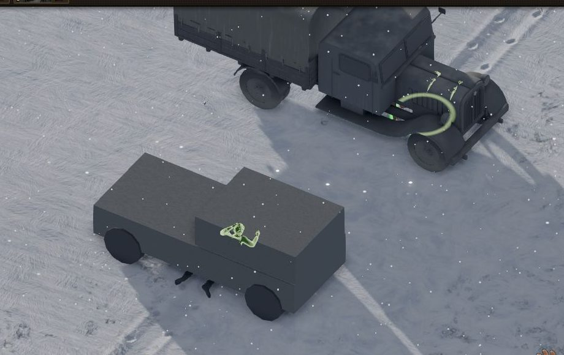 | 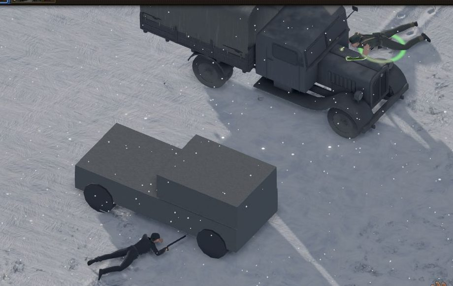 |
| 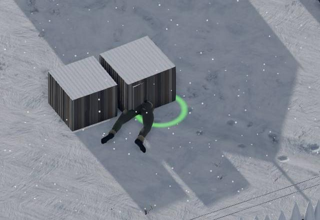 M2 `crates1`: head and chest in the crate | 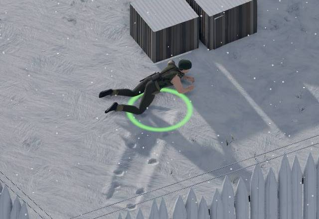 the same crawl stops clear |

- **Turrets** turned the wrong way visually: models applied `turret.rotation.y = local` while the hull uses
  `headingToRotY` (π/2 − h), so every barrel off the hull axis was mirrored (and pointed at things the gun was not aiming
  at). Both model families now apply `−local`.
- BCD placeholder devices stood half underground and rotated 90° (the wagon lay across its rail): they stand on the
  ground, keep their length along the heading; the lift is an open cage (riders stand inside, not inside a block); the
  drawbridge boards are flush with the banks.

### Targeted data fixes (shipped missions)

The rules run on every mission at load. For the five shipped maps their visual-driven moves are also baked into the
mission data, so the node unit tests (grid only, no visuals) and the browser play the same positions, and the rules
find nothing left to do (they stay as the safety net for new content).

| map | change |
|---|---|
| m00 | drum, bush and lamp post moved clear of barracks1's steps, the road and the bridge ramp |
| M1 | `barr_L_b` turned E–W and moved to z 29 (its roof and snow skirt crossed `barr_L_a`'s); `relay_mast` 1.65 m off the hut's eaves; drums `b2`–`b5` clear of the barracks' steps / skirts; `pole_2` 0.15 m off `wall_s` |
| M2 | **`t1` / `t2` inside the palisade, outer legs against it** (e8 / e9 with them); `cab1` and `cabA` clear of the palisades; drums `bar1` / `bar2`, rocks `rocks_n1` / `rocks_n3`, the islet pines clear of the cabin, the palisade and the boat lane; `e3`, `e12` out of `cabB` / `cab1`; `e5` 0.3 m off the palisade line on the new walk deck (≥ 0.32 m breaks the §7.5 step 2 body puzzle, `tests/unit/m02-walkway.test.mjs`) |
| M3 | the east transformer-cage column at x 55 (was 56: clear of `st_barr2`'s steps and `pylon_1`'s legs); `pylon_3`, a pine and the `bombs_shed` pickup (it lay on the barn's ramp) moved; `e24` out of `st_barr1` |
| b00 | none (the pen gate and the drawbridge were fixed in code) |

## Second pass: the verifier's findings

An independent verification of the first fix (its re-run of this audit, a 455-gun turret stress test beside every wall
and fence, a tile-by-tile visual sweep of M1–M3 at 2× zoom) confirmed the static / turret results and found what the
first pass missed. Each item below is now fixed by a generic rule (they apply to missions 4–20 and phase 3 as well) and
guarded by a test; the audit tool gained the checks that would have caught them.

| verifier finding | cause | fix (generic) | now |
|---|---|---|---|
| M2 sentry `e5`'s corpse draped through the top of the palisade (0.159 m) | on the 1.4 m wall walk no fall line is fully free, so `fallHeading` kept the heading (towards the stakes); the stakes stand over walk cells the nav grid calls open | the fall takes the line that stays clear longest, weighted to the side the death clip falls (backward from a stand, forward from a run); a quarter-cell layer of *standing visuals* (`grid.solid`: what rises 0.15–1.2 m above the local ground / deck / walk) and `settleSolid` slide the body up to 0.6 m off them | clear at every one of 24 headings; M2 bodies 1 → 0; GPU test |
| Turret arcs and the drive probe ignored roof eaves (tank beside M2 `cabA` 0.40 m, `cabB` 0.14 m) | both worked from footprint cells, eaves counted as open ground | `grid.overLo/overHi` from the visuals above 1.8 m over open cells: the drive probe refuses overhangs lower than the vehicle (`hullHeight()`), a gun closes every angle where one comes down to its barrel or turret roof (turret housing included); tree boughs (`softLo`) close gun angles too | turret probe on all five maps: 0 overlaps (349 parked guns); unit tests |
| — found by the new turret probe | the drive probe's three nose samples let a lone post / trunk slip between them; a barrel line slipped through a diagonal wall's cell corners; wall / rock heights came from the data `h`, lower than the visual | ≤ 0.4 m nose samples; barrel sampled ±0.2 m across; `grid.blockTop` = measured visual top of footprint cells | as above |
| Moving units still clipped (m00 bridge 0.11–0.17, M2 `cabA` / `cabB` / `cab1` 0.10–0.13, b00 drawbridge 0.12–0.15 and switch 0.15, M3 squads / diver) | walkers passed right beside visuals whose edge fell just short of a cell centre; a single ground height per body let the leading boot into a kerb's side; the drawbridge boards stood 0.15 m above the carved bank the feet followed; devices were not solid | 0.2 m body clearance in the visual nav blocks; feet on the highest low surface within 0.18 m; movable decks carry their walkers (`world.surfaces`); switch posts and sea mines are solid and approached at their edge; the drawbridge keeps swimmers off its sides | m00 9 → 5 (bridge 4 → 0), M2 11 → 0, b00 7 → 0, M3 36 → 17 (squads at cabin corners / a ramp, the dam, a door frame remain: see Results) |
| Floating props on slopes (M3 `well` 0.12, b00 `lift1` 0.07, `knap_drv` 0.06) | the terrain was levelled under footprints only | `stampFlatBase`: the ground is levelled under every prop's visual base (+1 cell), interactables included | `clip.floating()`: 0 on all five maps; GPU test |

| | before (verifier's crop) | after |
|---|---|---|
| M2 `e5` shot on the wall walk | 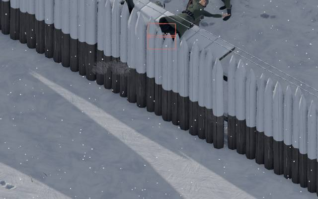 | 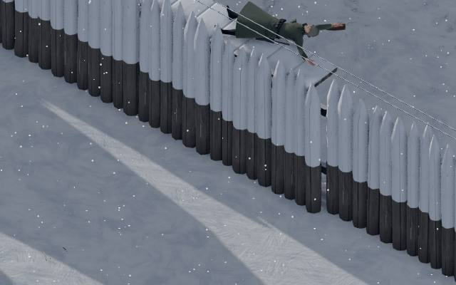 |
| `panzer2` beside M2 `cabA` (before: spawned under the eaves, turret at 60°; after: parked where it can drive, turret asked to 230°, snapped to the nearest open angle) | 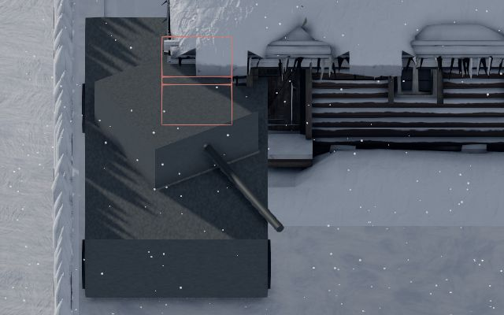 | 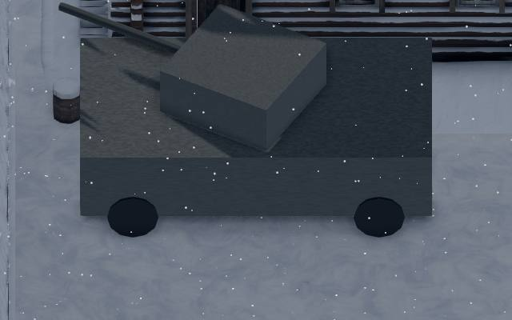 |
| b00 driver at the drawbridge's east end | 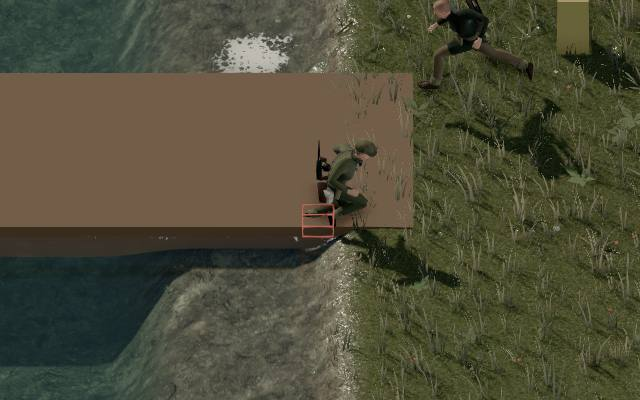 | 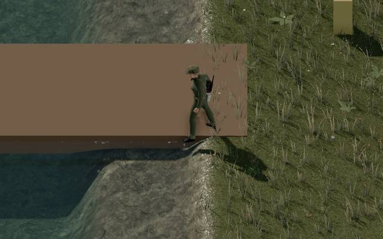 |

## Third pass (clip-2): moving units, and the dynamic run as a gate

The second pass left 26 moving penetrations deeper than 5 cm. Clip-2 classified every one of them (and those a second
seed turns up), fixed each class with a generic rule, and made the dynamic run part of the acceptance:
`tests/clipping.test.mjs` now runs the same 180 s simulation as the tool on all five maps for **two seeds (7 and 11)**
and fails on any unintended penetration deeper than 5 cm by a live unit or vehicle. Corpses are left to the bodies
workflow (Rapier); they are logged, not asserted.

| class | cases (before) | rule (generic) | where |
|---|---|---|---|
| Walk height on dams and bridges | M3 squads, `e1`, `e29`, the Sapper through the dam's crest and parapets (0.13–0.28 m, 9 of 19 on M3) | **the walkable deck follows the asset's own crest** (`bridge.crest_poly` of the dam sidecar): the data rect was the arch's chord, so at both ends walkers stood on air beside the curved crest and walked through its parapet ends. The bridge cells, the measured deck field and its parapet cells now come from the crest polygon. On a deck the feet ring reads the deck's own kerbs and abutment tops. A Sapper walked over the M3 dam end to end: deepest contact 0.155 m before, 0.05 m after | `building-props` / `building-library` `bridge.crest`, `map-builder` (bridge footprints), `map-library.libraryDecks` |
| Path too close to geometry | m00 walkers vs sandbag courses and the bridge; M1 diver / `e5` vs `jetty_s` / `pier_n`; b00 Green Beret vs the fuel tank, Spy and Natasha through a knapsack | body clearance 0.2 → **0.3 m** everywhere (`RULES.bodyNav`: visual nav blocks, decks with no half-margin exemption, solid devices, idle pushables); InstancedMesh visuals (sandbag courses, stake rows) are measured too; posts and railings block the deck cells within 0.3 m and so do a deck's open edges (its surface drops more than 15 cm there: a pier on the bank, a raised crest; landings flush with the ground stay open); piers keep swimmers 0.7 m off their edges and piles (a swimmer lies along his heading); a knapsack or a pickup crate on the ground is solid and taken from its edge | `map-builder` `stampVisualNav` / `deckCover` / `deckEdges`, `placement-visual` `meshMatrices`, `interactables` / `bcd-interactables` |
| Feet at steps, kerbs, ramps | m00 / b00 boots in a bridge end, a plinth, the drawbridge's 3 cm lip; M3 squads against `st_shed`'s ramp, the dam's abutment lip | low parts (0.12–0.3 m: a ramp's side, a step's face, a plinth) keep the 0.3 m clearance on the ground beside them, not on their own tops (walked on); the feet ring reads the soles at full height (rings at 0.1 m and 0.2 m: a stair's next step in front of the shins) and two stride rings (0.27 m, 0.36 m) that count lower, less for a low lip, over surfaces up to a door sill (0.8 m); deck and drawbridge edges count as steps for a dry walker (≤ 0.45 m); walking or running, the body rides up over a step 0.5 / 0.6 m before or behind it (the toe leaving it, the heel kicking up). `groundY` got faster on the way (1.7 µs a call, 1.9 before: numeric sample keys) | `map-builder` `stampVisualNav` (low parts), `deckGroundY`, `Unit.syncTransform` |
| Steering / goals | units stopping with a shoulder or rifle in a wall; b00 Sniper arriving at a run, his leading boot in the fuel tank (seed 11) | `findPath` pushes a goal 0.45 m (a stride's reach) off any structure-blocked neighbour, within its cell (`clearOfWalls`) | `pathfinding` |
| Running off a post | M2 sentry `e5` turning to run off his wall-walk post: his heel, 0.85 m behind him in a running stride, kicked 0.14 m into the palisade stakes (seed 11) | while a wall, a stake or a building stands within a stride's heel reach behind a runner, his first strides are shown as a walk at the same pace (moving his post instead made his corpse slide into the walk deck) | `Unit._heelBlocked` |
| Wading (found on the way: master's M3 solution) | the low-part stamps of the dam closed the M3 tailwater's toe ledge, the Sapper's way to his second charge | no low-part stamps in shallow water (a boot under the water line kicks no step face anyone sees) | `map-builder` `stampVisualNav` |
| Layout | m00 `barracks1`'s gable door: its steps stood 0.8 m from the compound wall, a way narrower than a body that `keepWays` must keep (the door is a way point) | data: `barracks1` x 52 → 52.5 and 10 → 9.6 m long (1.6 m; at 52.6 × 10 m its east eaves went 8 cm into the east wall once master's barracks fit) | `missions/m00_sandbox.js` |
| Arm / rifle pose near walls | M1 `e8` aiming into `wall_s`, b00 `pack_guard` into a wagon (seed 11) | aiming or shooting, a unit steps back (≤ 0.6 m) until the shouldered barrel (0.3–1.1 m ahead) is clear of any wall, building, parked hull or wagon taller than his shoulder; over sandbags or from a wall walk he fires over | `placement.weaponRoom`, `Unit._keepWeaponRoom` |
| Climbs | M1 Green Beret through `wall_s` (0.30 m) and `pole_2` | a climb follows the wall's real top (`climbTrack`: rises at the face, crosses above the measured top, drops on the far side, faces the wall going down); climb / ladder landings are obstacles for poles, trees and props; a link end keeps its own cell open (0.4 m; it had the 0.9 m doorway disc, which left the wall beside it open) | `placement` `climbTrack` / `landingObstacles`, `Unit._followPath`, `navKeepPoints` |
| Heads under eaves, lintels | M3 garrison `camp_barr#0.0.1` leaving the barracks (0.30 m) | open cells under an overhang lower than 1.9 m above the walking surface are nav-blocked | `map-builder` `stampHeadroom` |
| Raised walks | M2 garrison squad on `walk_sw` inside the palisade stakes (seed 11) | walk cells within 0.3 m of what stands on the walk (stakes, a parapet, a railing) are nav-blocked; where that would split the walk, half the margin, else only the cells the stakes stand in | `map-builder` `stampWalkClearance` |
| Raised decks (after master's dam front) | M3 `e2` / `e3` aiming and `e8` running on the dam crest with a shin in its 0.6 m downstream parapet (0.055–0.062 m, both seeds): the crest became a raised walk (grid elevation 7.28 m) which neither the deck cover (decks at ground level) nor the raised-walk clearance (not decks) saw | the raised-walk clearance covers raised decks too (a dam crest, a high bridge); the crossing and every path over the dam are unchanged | `map-builder` `stampWalkClearance` |
| Boom barrier footway | M2 `barr_out` running through `gate_se`'s footway, an elbow in the fork rest (0.054 m, seed 11); `barr_camp` aiming in the footway with his rifle in the far gate post (0.136 m) | the fork rest and the far gate post keep the 0.3 m body clearance on the footway's side (the footway stays ≥ 0.9 m); a gate's fixed posts (pivot post, fork rest, log gate posts) are body solids (`world/body-clearance.js`) that stand on when the boom is smashed, those from hip height up 0.2 m wider, the fork rest also covering the resting pole tip (a running man's hands, arms and rifle, a crawler's drawn-up knee; `barr_camp`'s hand in the pole tip, 0.065 m; `barr_camp` running past the far post, 0.101 m; the diver crawling past the pivot post, 0.111 m); an aiming man treats the boom's pole line above its rest height as solid (the pole swings up through it whenever the gate opens: M2 `e7`'s rifle in the rising tip, 0.055 m) | `map-builder` `stampBarrierGaps` / `stampBodySolids` |
| Rifles at solid props | b00 `yard_guard` aiming with his barrel in the fuel tank `tank1` (0.08 m, seed 11): the rifle check only knew grid blocks, hulls and wagons, and the tank's visual reaches past its footprint | the body solids carry their height (`top`); an aiming man steps back (a quick 1.6 m/s half step, done before the rifle is up) from a solid prop taller than his shoulder too, and the barrel is sampled ±0.25 m across and out to the muzzle (1.15 m; a wagon or fuel tank with 5 cm to spare) (the rifle sits off the body centre; M2 `e7` with his muzzle in a gate post) | `map-builder` `stampBodySolids`, `Unit._keepWeaponRoom` |
| Lying men turning | b00 Sapper crawling along the fuel tank `tank1`, hands in its side (0.088 m, seed 7): sliding along it, the body guard turned his sim heading 119° in one tick; the shown body (art/prone-ground.js) follows at 112°/s and swept through the tank on the short way round | a crawler's heading (following his path, or sliding along an obstacle) turns no faster than his body is shown turning (M2 diver: his lagging legs swept through the barrier's pivot post); a settle turn (turned clear of a hull in place) is shown pivoting about his hips, as its sweep was checked | `Unit._guardBody`, `Unit._arrive`, `art/prone-ground.js` (`pivot`) |
| Stairs (found on the way: master's M2 access platform) | the wider body clearance and the raised-walk clearance closed the access platform's stair foot and two of its treads | a stair's graded run and the step onto it at either end are never stamped (its hand rails are walk-only footprints already); its two ends are ways `keepWays` keeps; the raised-walk clearance skips ramp cells and keeps every way off a raised piece | `map-builder` `stampVisualNav`, `rampEnds`, `stampWalkClearance` |
| A crawler's limbs | b00 Green Beret crawling off the wagon `wagon1`, his toes in its side (0.083 m, seed 7): the body capsule (1.3 m ahead, 0.92 m behind, 0.3 m wide) missed the crawl stroke's limbs (the straight leg's toes up to 1.07 m behind and 0.37 m out, the drawn-up knee 0.64 m to the side); and lying down he started turned the way he last lay (a stale shown heading) | the prone body reaches 1.05 m behind and carries limb discs (knees, toes) in every body-clearance check; a man not lying has no shown prone heading left over | `world/body-clearance.js` (`BODY.prone`, `LIMBS`), `art/unit-model.js` |
| Arms by a fuel drum | M2 `e12` turning on the spot beside the drum `bar4`, his swinging arm and port-arms rifle 0.053 m into it (seed 11; the body capsule, 0.3 m, stood 5 cm off the drum's 0.34 m disc) | a standing drum's body-clearance disc is 0.42 m (its rims: 0.32 m radius): the rest is the reach of a running man's arms and rifle past his body | `world/body-clearance.js` `DRUM_R` |
| Kneeling gunner's back foot | M2 MG gunner `e8` on platform `t1`: the kneeling shot's back foot points straight down, its toe 15 cm through the deck planks (0.059 m by the audit, seed 11; on the ground the terrain hides it) | the platform gunner's `mg_kneel` lays that foot back flat, instep on the deck (toe 2–3 cm above it) | `art/body-clips.js` `mg_kneel` |
| Corpses' flung-out hands | M3 `e7` killed beside `camp_barr`: lying on his back, a hand 1.6 m from where he stood, in the barracks' foot (0.051 m, seed 7, body; not gated) | a man who falls on his back shifts ≤ 0.6 m until both hands (1.45 m behind, 0.7 m out) are off structure and visual-nav cells, his body line still clear | `placement.settleHands`, `Unit.die` |
| Instanced repeats | M3 squad at `cabin_3`'s door, boots in its porch boards (0.089 m, seed 11): three identical cabins become one instanced batch, which disposed their own meshes *before* the low surfaces under the feet, the standing visuals and the head room were measured | the repeats are batched only after every visual measurement | `map-builder` (`batchLibraryRepeats` call) |
| Lying down beside steps | m00 Green Beret crawling past `barracks1`'s gable steps, head and arm in their side (0.074 m, seed 7); b00 Sapper lying beside the fuel tank, an elbow in its base (0.089 m) | a crawler's body (hips ± 0.9 m, head and weapon 1.2 m ahead, elbows ± 0.6 m; every sample bounds the tilt, so neither boots nor head dip under the ground) rises and pitches (≤ 12°) just enough to lie over a step or kerb ≤ 0.35 m under it: scripted crawl past the steps 0.074 → 0 m | `Unit._crawlOverSteps` |
| Spawns / posts / doors in geometry | M3 garrison squad appearing beside `camp_barr`'s snow skirt (seed 11): the 0.9 m doorway disc was kept open at the layout's door side, 2.1 m from the asset's real door; M1 `e9` past `house_s`'s steps inside the doorway disc | a garrison's doorway is at the asset's main door (as hideouts already were); a real door keeps only its approach cell open (0.5 m), the way out of it is kept by `keepWays` (below), so steps and railings beside it keep their clearance | `map-library.libraryDoorPoints`, `navKeepPoints` |
| Trees | M3 diver past a pine's low bough; M2 patrol boat vs a spruce bough sagging over its lane | below head height a limb's **wood** ends at the trunk's reach (its needle sprays stay: walkers brush through needles as through a bush, `character`/`foliage` is a natural contact — cutting the needles too stripped every spruce of its lowest tiers, fix/m1-tree-detail); a crown lifted over a vehicle lane also gets a floor at the vehicle's top + 0.25 m (a drooping spruce bough is lifted onto it with its sprays, one born under it is dropped), and lanes are as tall as the vehicles (3.2 m) | `conifers.limbClearance` / `clearBranch` / `liftBranch`, `placement.pruneTree` / `routeObstacles` |
| Ways kept open | (found on the way: the wider clearance first closed M3's dam crest, the mission's only crossing, and some lanes and doorways) | no stamp may cut a way. A deck keeps its crossing (end to end over the deck and dry ground; a wade along the dam's toe ledge does not count), else its stamp steps down (half margin, what stands right there, without the deck cover). Every way between the mission's points (spawns, posts, pickups, devices, exits, real doors, link ends, deck ends) that was open before the stamps stays open: where one is cut, only the stamp cells that make the cut (both sides within 1.5 m; else those hemming the cut-off piece) step down a level, low parts first, down to none as a last resort, and the check runs again. Reachability of every mission point is the same as on master (M3 `e34` gained a way) | `map-builder` `deckCrossing`, `keepWays`, `walkPieces`, `missionWayPoints` |
| Hulls turning in place | tank beside M2 `sw_wall` / a wall ahead: corners swept 5–26 cm into it | the drive probe now covers turning: a driven hull turns in place only while its outline (+5 cm, ≤ 0.4 m samples) stays out of blocking cells and eaves; with no room it backs up (≤ 3 m) first — or pulls forward when its tail is against a wall (M20 `pz3`) — else the order is refused (forbidden cursor). Only what stands there blocks the sweep (`_sweepFree`: walls, posts, eaves, a raised walk above the hull, other hulls), not a lower bank, open water or the rest of the ramp the hull is on (M11 half-track) | `Vehicle._outline` / `_turnClear` / `_sweepFree` / `turnPlan` |
| After the merge (final suite) | m01 slow truck stopping 5 cm off a crawler's capsule with his knee 0.32 m under the bonnet; m00 group of three crossing the bridge between its end posts (deck 2 m wide there) with two men 0.07 m apart; M1 soldier sent across the drums from 180° timing out | moving hulls and pushed wagons check the whole body (`bodyRectGap`: limbs, a corpse's arms); a hard floor between the commandos of a group (`Unit._keepApart`, 0.8 m, braking at a walker's rate) under the lanes the walls cut back; the drums plug the barracks alley's mouth, so the way is round `barr_L_b` (38.7 m) — the approach runs now get their path's time and no longer count a man who gave up against the drums as arrived (master's pass was that) | `world/body-clearance.js`, `entities/vehicle.js`, `entities/bcd-interactables.js`, `entities/unit.js`, `tests/vehicle-clear-page.mjs` |
| Striding in place | M2 `barr_out#0.0.1` holding for a mate beside `gate_se`'s fork rest, his lane sidestepping while he waits (shown walking): the leading boot of the stride 0.56 m ahead, 6.6 cm into the rest (seed 11, once the commandos' floor changed the run) | a man making no headway (path pace < 0.3 m/s) with a wall, a solid footprint, a solid prop (with its reach) or a hull where his leading boot lands stands instead of striding (held 0.3 s: no gait flicker) | `Unit._toeBlocked`, `Unit._updateAnim` |
| Hulls turning round (2026-10-07, M3 video: the escape truck's nose crossed the rock rim) | the M3 evac truck turning on the spot by `rim_e`; route vehicles (M11 tanker, M18 SdKfz) checked only their centre and scraped rigs / houses | land hulls steer like cars (`entities/vehicle-maneuver.js`): arcs no tighter than `def.turnRadius`, multi-point turns (forward / reverse / forward) planned on the real footprint (outline +0.15 m, wheels on drivable ground); route legs are planned round walls (hybrid A* on a 0.5 m × 5° lattice), shut gates are waited at, two hulls holding each other up: the later one backs off; while moving only what comes and goes is re-checked (other hulls by overlap depth, shut gates, men) | `Vehicle._planFree` / `_poseFree` / `_dynFree` / `_planDrive` / `_planRoute` / `_yield` |

The verifier's eaves finding (tank turret and barrel inside `cabA`'s eaves, 0.40 m) was re-checked on the live code:
turret arcs and the drive probe already use the real roof meshes (`grid.overLo`, measured on the visuals above 1.8 m,
since the second pass): a `panzer2` or `sdkfz` driven at `cabA` / `cabB` from any side stops 1.2 m short of the eaves
with hull and turret clear, and in play its arc is clean (0.417 m only with `turrets({raw: true})`, the rule switched
off). What was left was turning in place (above).

Dynamic penetrations > 5 cm, live units and vehicles (`node tools/audit/clipping.mjs`, 180 s; "before" is master
c75ae22):

| map | seed 7 before | seed 7 after | seed 11 before | seed 11 after |
|---|---|---|---|---|
| m00 | 6 | **0** | 6 | **0** |
| M1 | 4 | **0** | 7 | **0** |
| M2 | 0 | **0** | 3 | **0** |
| M3 | 19 | **0** | 10 | **0** |
| b00 | 1 | **0** | 4 | **0** |
| **total** | **30** (worst 0.30 m) | **0** | **30** (worst 0.47 m) | **0** |

Static and turret overlaps stay at 0, the turret probe at 0 overlaps > 5 cm (322 parked guns), floating props at 0.

The four worst cases of the "before" run:

| worst case (before) | before | after |
|---|---|---|
| M3 garrison `camp_barr#0` just out of the cabin, 2.5 s in (0.30 m into its eaves and skirt at t = 9 s): before, two of them stand against the wall; after, on clear ground | 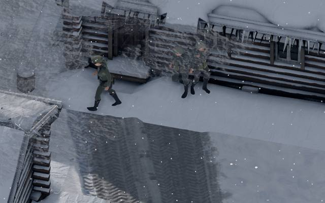 | 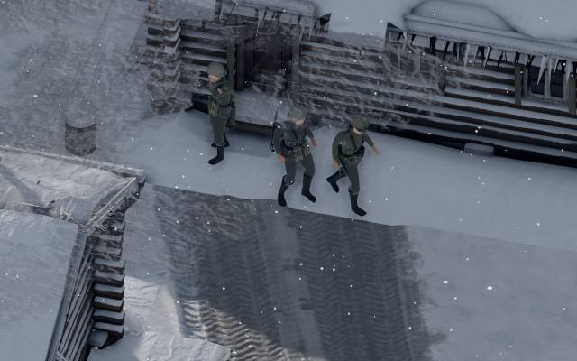 |
| M1 Green Beret climbing `wall_s` (0.30 m): the same scripted climb before and after; before, he crosses inside the wall at ground level (only his selection ring shows), after, on top of its plank roof (0 contact all the way) | 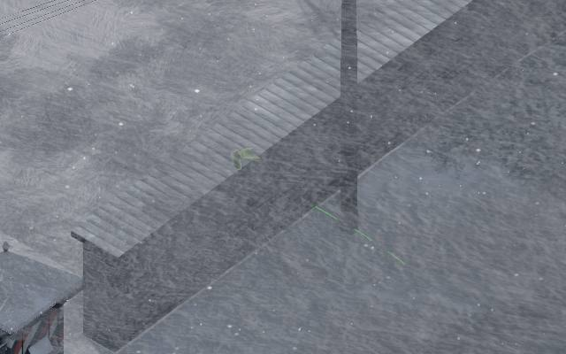 | 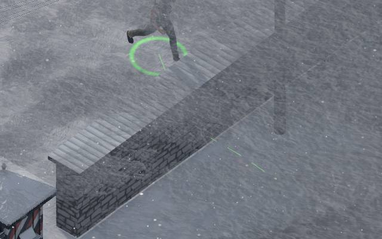 |
| M3 Sapper at the dam's west end (0.28 m): the same scripted walk over the dam before and after; before, half his body is inside the parapet, after, he walks the curved crest (deepest contact all the way 0.05 m) | 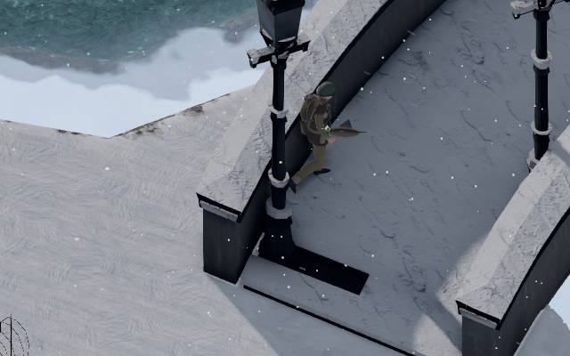 | 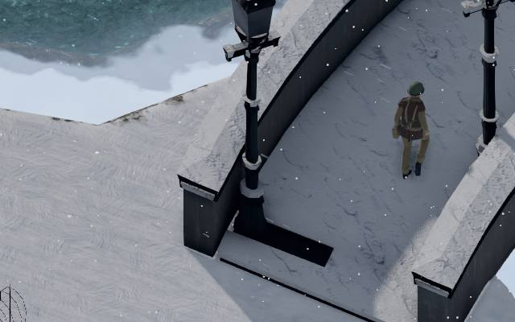 |
| b00 Green Beret against the fuel tank (0.16 m, t = 127.5 s): after, a guard passes the tank at the body clearance | 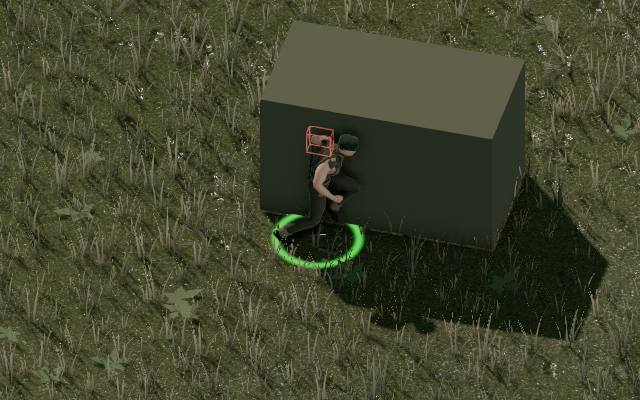 | 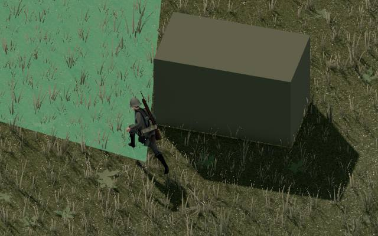 |

After the master merge (the dam crest became a raised walk): the seed-7 run at t = 115.5 s, where `e3` stood with a shin in the downstream parapet (0.062 m) — now the squad fires from the crest clear of it:

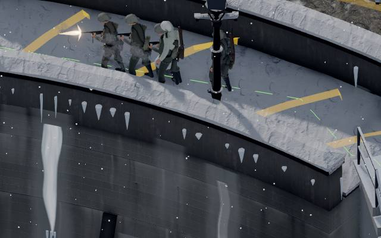

## Results: before → after (first and second pass)

Same maps, same audit (`node tools/audit/clipping.mjs`: static + turret sweep + 180 s dynamic, seed 7).

Dynamic columns: before → first fix (6d58e47, the verifier's re-run) → second pass.

| map | items | unintended static + turret | turret probe: overlaps / parked guns | floating props | dynamic penetrations > 5 cm | of which bodies | worst dynamic depth |
|---|---|---|---|---|---|---|---|
| m00 | 30 → 29 | 2 → **0** | **0** / 48 | **0** / 12 | 24 → 9 → **5** | 3 → 0 → 0 | 0.25 → 0.17 → 0.075 m |
| M1 | 68 | 6 → **0** | **0** / 94 | **0** / 23 | 15 → 6 → **4** | 0 → 0 → 0 | 0.50 → 0.30 → 0.30 m |
| M2 | 66 | 15 → **0** | **0** / 76 | **0** / 20 | 30 → 11 → **0** | 0 → 1 → **0** | 0.55 → 0.16 → — |
| M3 | 109 | 5 → **0** | **0** / 87 | **0** / 32 (was 1) | 76 → 36 → **17** | 0 → 0 → 0 | 1.50 → 0.31 → 0.30 m |
| b00 | 39 | 3 → **0** | **0** / 44 | **0** / 10 (was 2) | 30 → 7 → **0** | 0 → 0 → 0 | 1.10 → 0.23 → — |
| **total** | | **31 → 0** | **0** / 349 | **3 → 0** | **175 → 69 → 26** | 3 → 1 → **0** | |

`tests/clip-baseline.json` is empty: no overlap is accepted any more, and `tests/clipping.test.mjs` fails on any new one.
m00 lost one item (wall#3 is drawn by wall#2's chained run). The three remaining (allowed) static contacts are all
"resting on a surface", under 1 cm deep: the MG gunners e8 / e9 standing on their measured tower decks, and the snow
skirts of M1's two long barracks meeting on the ground between them.

At the time the dynamic run was not a gate (one seeded run, a tool rather than a test). What remained then (all fixed by
the third pass, see "Third pass (clip-2)"):

- **M3 dam (9 of 17)**: the arch crest curves while its nav deck is the straight 27 × 4 m rect; walkers crossing near
  both ends brush the curved parapet ends and the abutment blocks (0.2–0.28 m). The deck is measured, the parapets,
  lamp posts and end blocks are nav blocks, the landings follow the abutment tops, and the crossing stays open (the
  mission's only one). Fixing the rest means authoring the dam's walkable deck as a curve.
- Garrison squads leaving a barracks pass its door frame (M3 `camp_barr`, 0.30 m at the first step out): door
  approaches keep a free disc on purpose.
- Striding feet and shins at building corners and ramps: M3 squads at `cabin_1`'s corner (0.18 m) and on `st_shed`'s
  ramp (0.17 m), the diver past a pine's low bough (0.09 m). A walking boot reaches ~0.5 m ahead of the body; the
  0.2 m clearance and the stepped feet do not cover a full stride.
- Sandbag walls brushed by passing walkers (m00, 0.06–0.075 m); the diver's arm at a jetty edge (M1, 0.12 m).
- The GB climbing over M1 `wall_s` (0.3 m at the climb, the plank roof) and past `pole_2` (0.12 m).

### Before / after: static (all 25 cropped findings)

Same framing as the audit's crops; the green box is where the red finding was.

| map | pair | before | after |
|---|---|---|---|
| m00 | `bridge` × `lamp_post#21` | 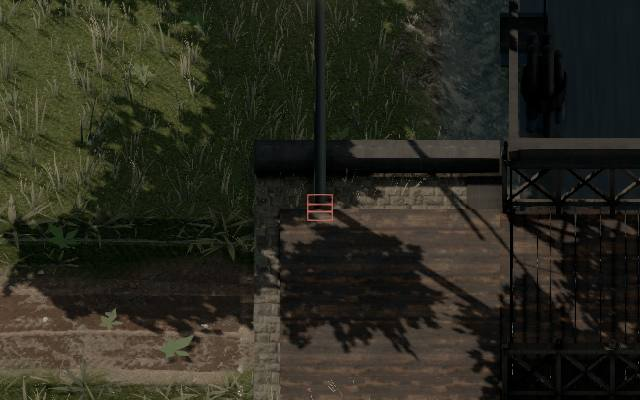 | 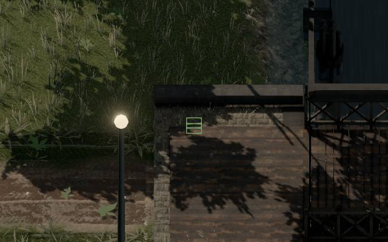 |
| m00 | `wall#2` × `wall#3` | 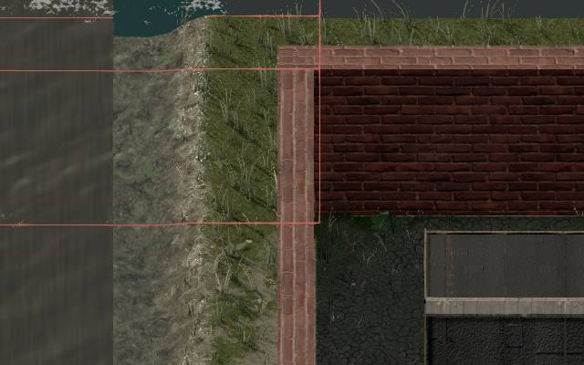 |  |
| m01 | `barr_L_a` × `barr_L_b` | 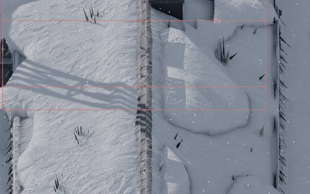 | 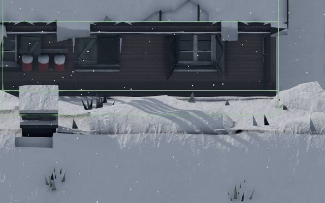 |
| m01 | `relay_hut` × `relay_mast` | 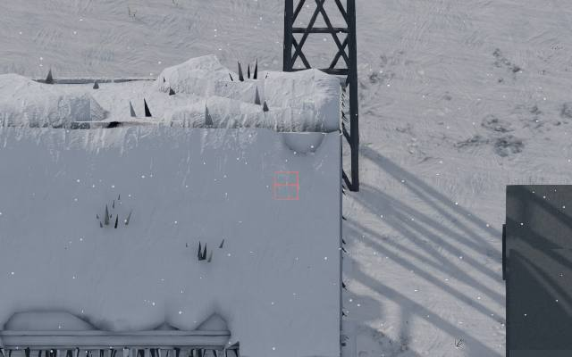 | 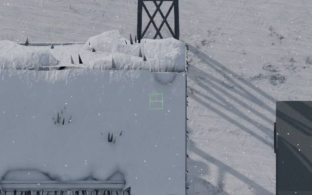 |
| m01 | `barr_2` × `b5` | 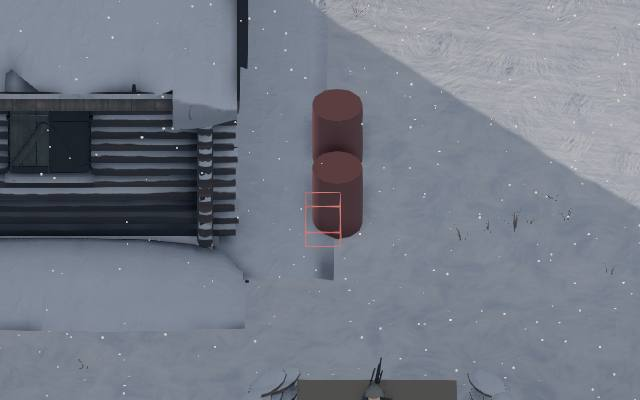 | 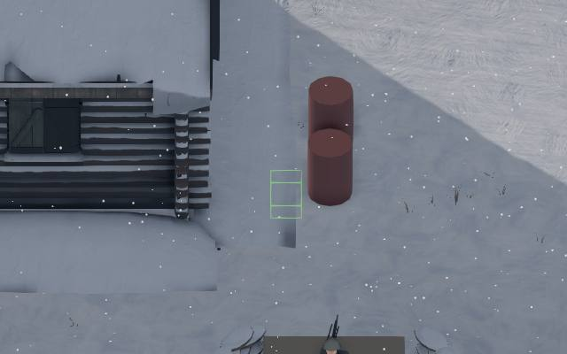 |
| m01 | `barr_L_b` × `b1` | 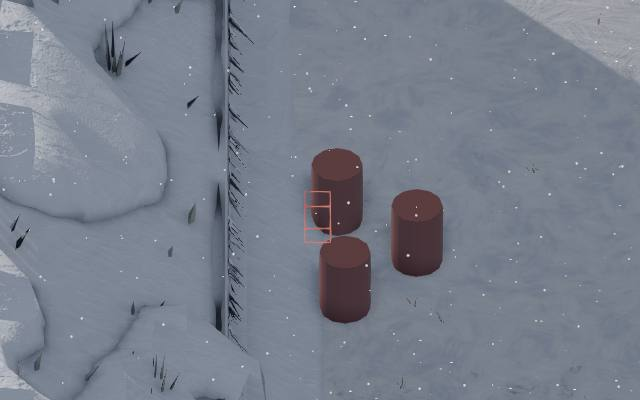 | 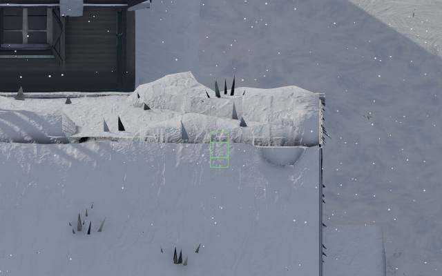 |
| m01 | `barr_2` × `b4` | 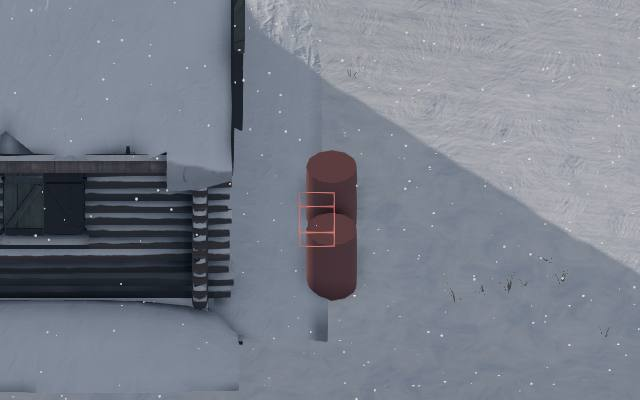 | 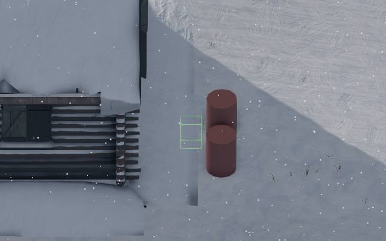 |
| m02 | `camp_wall` × `cab1` | 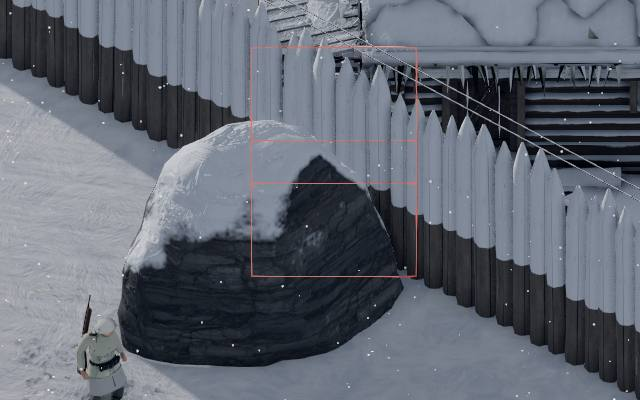 | 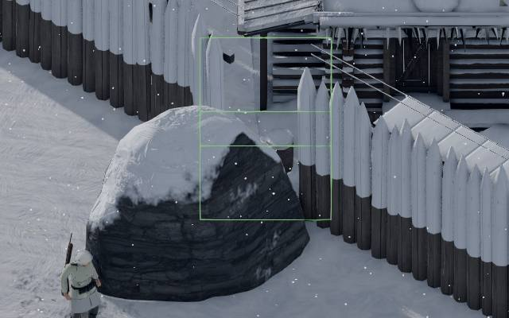 |
| m02 | `sw_wall` × `cabA` | 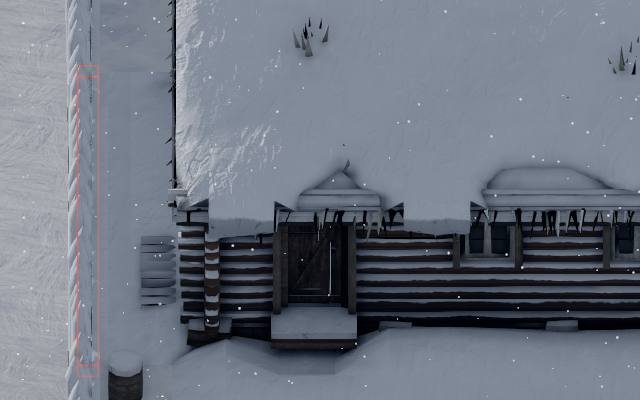 | 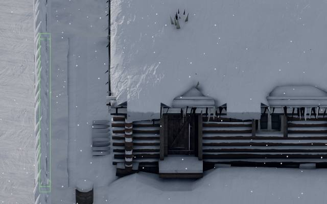 |
| m02 | `cab1` × `bar2` | 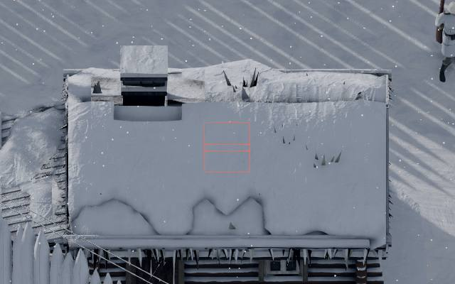 | 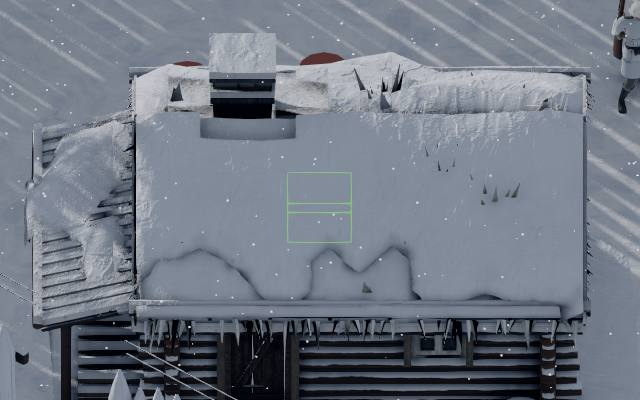 |
| m02 | `cab1` × `bar1` | 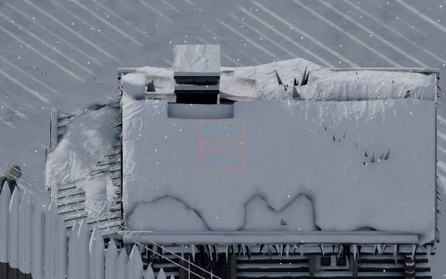 | 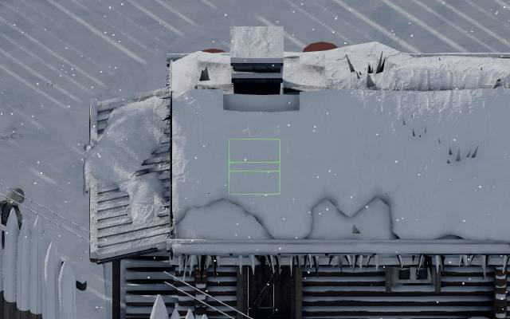 |
| m02 | `islet1` × `pine#19~trunk` | 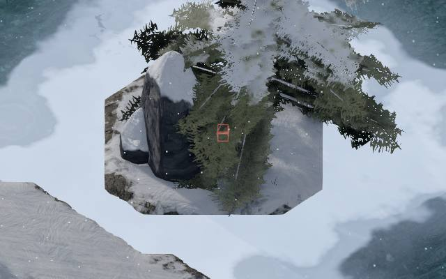 | 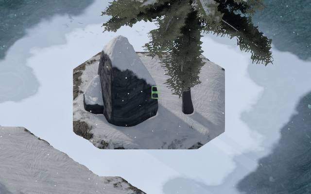 |
| m02 | `camp_wall` × `t2` | 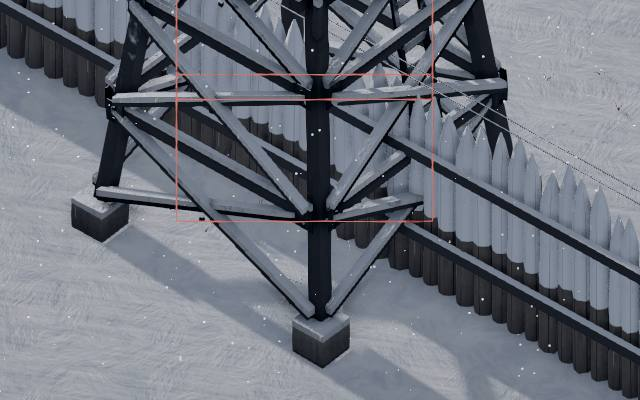 | 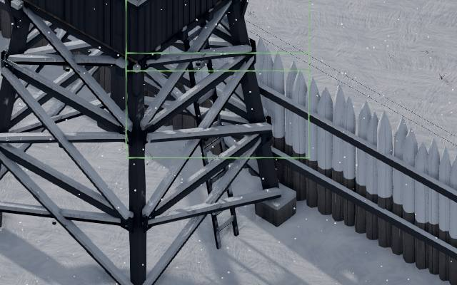 |
| m02 | `camp_wall` × `e5` | 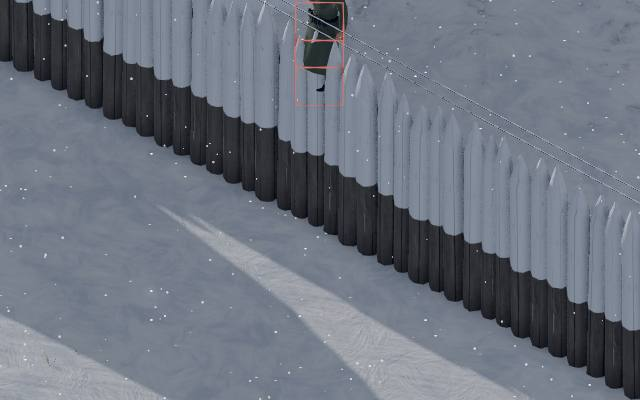 | 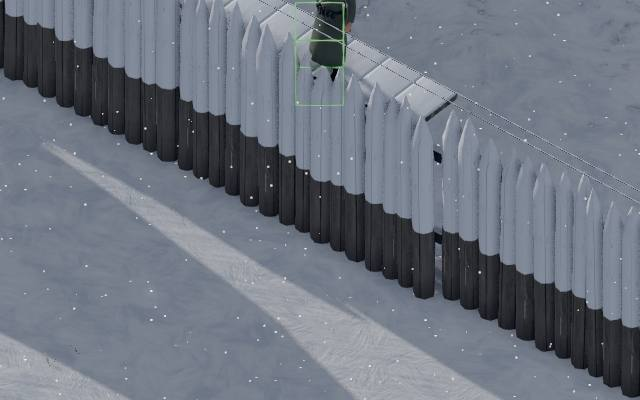 |
| m02 | `camp_wall` × `t1` | 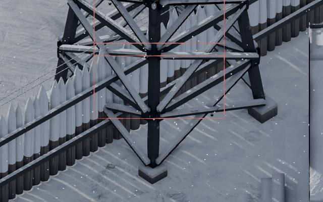 | 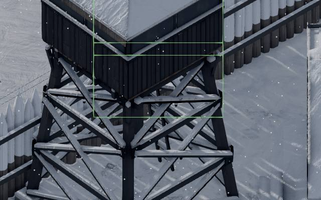 |
| m02 | `cab1` × `rocks_n1` | 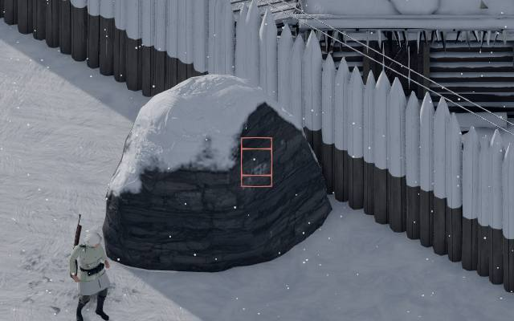 | 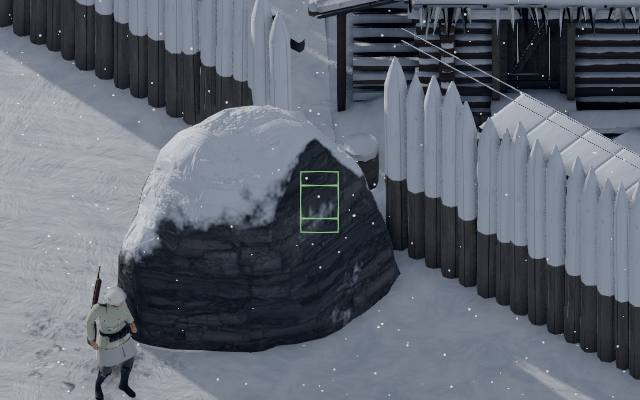 |
| m02 | `camp_wall` × `gate_se` |  |  |
| m03 | `dam` × `dam_bunker` |  |  |
| m03 | `st_shed` × `bombs_shed` |  |  |
| m03 | `st_fence` × `pine#59~foliage` |  |  |
| m03 | `dam` × `st_fence` |  |  |
| m03 | `cage_12` × `pylon_1` |  |  |
| b00 | `bridge1` × `boat1` |  |  |
| b00 | `bridge1` × `mine1` |  |  |
| b00 | `fence#2` × `pen_gate` |  |  |

The user's example, M2 `t1`: the tower now stands inside the palisade with its outer legs against it, and the wall walk
has a deck (e5 no longer stands in the air or in the stakes):

| map | what | after |
|---|---|---|
| m02 | t1 at its new spot, outer legs against camp_wall |  |
| m02 | walk_sw: plank deck, stakes stepped off it, e5 on the deck |  |
| b00 | wagon1 along its rail, standing on the ground (nav-blocked at rest) |  |

### Before / after: dynamic (worst cases)

| map | pair (before) | before | after (same spot) |
|---|---|---|---|
| m00 | `sentry_bridge` × `wall#3` |  |  |
| m00 | `sapper` × `bridge` |  |  |
| m01 | `e9` × `house_s` |  |  |
| m02 | `pboat` × `pine#19~trunk` |  |  |
| m02 | `e1` × `cabB` |  |  |
| m03 | `camp_barr#0.0.1` × `dam` |  |  |
| m03 | `sapper` × `dam` |  |  |
| b00 | `driver` × `wagon1` |  |  |

## Before (e8eea3f)

| mission | items | pairs tested | contacts | allowed | unintended static | turrets / hits | dynamic run (samples) | dyn. penetrations > 5 cm | of which bodies | audit wall time |
|---|---|---|---|---|---|---|---|---|---|---|
| m00 | 30 | 20 | 5 | 3 | 2 | 0 / 0 | 180 s (360) | 24 | 3 | 170 s |
| m01 | 68 | 19 | 7 | 1 | 6 | 1 / 0 | 180 s (360) | 15 | 0 | 98 s |
| m02 | 66 | 50 | 16 | 1 | 15 | 0 / 0 | 180 s (360) | 30 | 0 | 467 s |
| m03 | 109 | 109 | 6 | 1 | 5 | 0 / 0 | 180 s (360) | 76 | 0 | 333 s |
| b00 | 39 | 4 | 3 | 0 | 3 | 0 / 0 | 180 s (360) | 30 | 0 | 49 s |
| **total** | 312 | 202 | 37 | 6 | **31** | 1 / 0 | 15 min sim | **175** | 3 | |

Static audit cost is 0.1–1.1 s per map. The wall times above are dominated by the dynamic run. The per-sample character
broad phase was added after this run, which roughly halves m02.

**Static and turret, unintended (31, all accepted into the baseline at the time):**

| categories | n | | categories | n |
|---|---|---|---|---|
| building / prop | 7 | | building / pole | 1 |
| building / wall | 2 | | building / rocks | 1 |
| tower / wall | 2 | | building / tower | 1 |
| rocks / trunk | 2 | | bridge / building | 1 |
| character / tower | 2 | | bridge / pole | 1 |
| character / wall | 1 | | bridge / fence | 1 |
| building / character | 1 | | fence / foliage | 1 |
| building / building | 1 | | fence / pole | 1 |
| wall / wall | 1 | | fence / prop | 1 |
| gate / wall | 1 | | gate / vehicle | 1 |
| | | | gate / prop | 1 |

**Dynamic (175 pairs):**

| categories | n | | categories | n |
|---|---|---|---|---|
| building / character | 79 | | character / sandbags | 4 (+1 body) |
| bridge / character (incl. dam) | 35 | | character / trunk | 3 |
| character / prop | 25 | | building / character (body) | 2 |
| character / wall | 11 | | character / pier, / tower | 2 + 2 |
| character / gate | 6 | | vehicle / trunk | 2 |
| | | | character / pole, / cliff; vehicle / gate | 1 each |

### Worst static cases

| # | mission | pair | depth / contact / volume | crop |
|---|---|---|---|---|
| 1 | m03 | `dam` (bridge) × `dam_bunker`: the bunker is sunk into the dam crest | 1.29 m / 18.0 m / 4.6 m³ |  |
| 2 | m01 | `barr_L_a` × `barr_L_b`: two long barracks overlap, roofs cross | 0.51 m / 70.3 m / 1.6 m³ |  |
| 3 | m02 | `camp_wall` (palisade) × `cab1`: the palisade runs through the cabin | 0.42 m / 6.2 m |  |
| 4 | m02 | `camp_wall` × watchtowers `t1`, `t2`: **towers standing astride the palisade** (the user's example) | 0.14 m / 16.5 m and 12.1 m |  |
| 5 | m02 | `sw_wall` × `cabA`; `camp_wall` × `gate_se` (the gate leaves are 25 m of contact with the wall line) | 0.33 m / 6.2 m; 0.09 m / 24.9 m |  |
| 6 | m02 | `cab1` × drums `bar1`, `bar2`; `cab1` × `rocks_n1` | 0.27–0.29 m |  |
| 7 | m01 | `relay_hut` × `relay_mast`: a mast leg comes down through the hut roof edge | 0.20 m / 0.9 m |  |
| 8 | m00 | `bridge` × `lamp_post#21`; `wall#2` × `wall#3` run along each other for 17.5 m | 0.20 m; 0 / 17.5 m |  |
| 9 | m02 | tree trunks growing out of islet rocks (`pine#19`, `pine#21`) | 0.17 m |  |
| 10 | m03 | fences through things: `st_fence` × `dam`, `st_fence` × pine foliage, `cage_12` × `pylon_1` | contact 2.5 / 7.7 / 1.5 m |  |
| 11 | b00 | `bridge1` (swing bridge, cat. gate) × moored `boat1` and × `mine1` | 0.13 m / 10.4 m; 0.10 m |  |
| 12 | m01 | fuel drums `b1`, `b3`, `b4`, `b5` pushed 2–8 cm into the barracks walls | 0.02–0.08 m |  |

Spawn poses: `e5` stands 14 cm into the `camp_wall` walkway (m02), and `e8`/`e9` into the watchtower decks by 5 cm. `e12`
spawns against `cab1`.

**Turrets**: the current content has a single turret, the M1 MG nest `mg1_gun`, which is clean over its full arc. Tanks
and armoured cars are not placed yet in these maps. The sweep does work: the GPU test parks that nest 0.7 m from a barracks
wall and the barrel is caught (for example 0.05 m into the wall solid, 320°). Missions 4–20 get it automatically.

### Worst dynamic cases (180 s each)

| mission | pair (worst of the kind) | depth / samples | crop |
|---|---|---|---|
| m03 | **everyone walks inside the dam parapet / crest**: 35 unit×dam pairs, the worst `e6`, `e7`, `camp_barr#0.0.1` | 1.2–1.5 m (depth cap), ≤ 99 samples |  |
| m03 | units walking through `dam_bunker` (`sapper`, `e32`, `e17`, …) | 0.6–1.0 m |  |
| b00 | **every unit walks through the `wagon1` and `tank1` props** (no blocking footprint) | 1.1 m / 0.74 m |  |
| m02 | patrol boat `pboat` driving through the pine trunks on the islets | 0.55 m |  |
| m02 | sentries `e1`, `e2`, `e3` standing inside cabin `cabB` for the whole run; commandos brushing `cabA`/`cabB` corners | 0.42–0.51 m, 150–310 samples |  |
| m02 | at the alarm (t≈26 s) released garrison `e14`, `e16` pass through the walls of `barr_out` (spawn/exit point vs mesh, to check) | 0.39 m | |
| m01 | patrols `e8`, `e9` walking through the front of `house_s` (porch/steps slab above the nav ground, suspected) | 0.48–0.50 m, 146–164 samples |  |
| m01 | `diver` × `jetty_s`; commandos / `e6` brushing through the stone wall `wall_s` | 0.42 m; 0.30 m |  |
| m00 | every unit crossing `bridge` sinks 19–23 cm into the deck | 0.19–0.23 m, ≤ 32 samples |  |
| m00 | sentry and sniper walking alongside `wall#3` with the rifle and arm in the bricks | 0.25 m |  |
| m00 | **bodies**: `guard_fuel` and `patrol_east` killed next to `hut1` lie 10–11 cm inside its wall; `sentry_bridge`'s body is inside `sandbags#7` | 0.10–0.11 m; 0.08 m | |

The raw per-pair data (times, positions, unit states, counts, crops) is in `docs/clipping/<mission>.json`.

## Recommended fixes (as written before the fix; all done, see "Fixes")

1. **Linear runs vs structures (map-builder)**: split wall and fence runs where they cross a footprint that is not a
   joint. This covers buildings, towers, gates, pylons, dams and bridges (M2 palisade × watchtowers, cabins and `gate_se`;
   M3 `st_fence`, `cage_12`). An alternative is to move the run to the footprint edge and emit `clipAllow` for the joint.
   Watchtowers on a wall line should cut a gap as wide as the tower.
2. **Placement validation**: offset props (drums, crates, rocks) that are placed "against" a building out of its
   footprint plus 10 cm. M1 `b1–b5`, M2 `bar1/bar2/rocks_n1`, M3 `bombs_shed`. Reject trees whose trunk base is
   inside a rock or cliff prop, or on a boat route (M2 islet pines × `pboat`).
3. **Navigation vs meshes**:
   - Give every catalogue prop a blocking footprint derived from its mesh bounds or library sidecar (b00 `wagon1` and `tank1`, M3 `dam_bunker`, M1 `house_s` porch).
   - Take walk heights on bridge and dam decks from the deck mesh, not `deckY` (M0 bridge sinks 0.2 m, M3 dam parapet is walkable).
   - Inflate wall block cells by about 0.3 m for body clearance (arms and rifles in walls).
4. **Spawns and garrison release**: check enemy spawn points and barracks exit points against building meshes with
   `clip-geom.insideDepth` (M2 `e1–e3` inside `cabB`, released `e14`/`e16` crossing the walls of `barr_out`).
5. **Bodies**: when a unit dies, test the death-pose box against nearby static items. If it penetrates, slide the body
   out along the contact normal, or rotate the fall direction away from the wall (M0 `hut1`, `sandbags#7`).
6. **Boats**: moored boats and bridge spans. b00 `boat1` sits under or into the swing bridge `bridge1`.

## Limitations

- clip-2, after the second master merge: the two seed-11 M2 cases left open then (`e8`'s kneeling foot through the
  `t1` deck, `e12`'s arm in the drum `bar4`) and M3 `e7`'s corpse hand in `camp_barr` (seed 7) are fixed (table above).

- **Depth** is penetration into the other item's *solid*. A barrel poking through a thin wall into a hollow room gives a
  small depth but a non-zero contact length, which is why contact is reported (and ranked) too. One-sided categories
  (`foliage`, `fence`, `flag`, `wire`) are never used as the "inside" reference, so their pairs rank by contact only.
  Depth is capped at 1.5 m.
- **Dynamic run coverage**:
  - two deterministic 180 s runs per map (seeds 7 and 11; the GPU test runs both), not exhaustive: a third seed may
    still find a stride or a rifle brushing an edge. What no rule can fully cover without foot / arm IK: a boot at the
    very end of a stride over a step's edge, a rifle swung behind a running unit (the clearances, the feet rings and
    the ride-up reduce them below 5 cm on both seeds).
  - the commandos are invulnerable.
  - unit-vs-unit and unit-vs-vehicle pairs are not audited.
  - units in vehicles, hidden, buried, held or underwater are skipped.
  - crops of dynamic findings are taken at the moment of the worst sample.
- **Coverage gaps**:
  - terrain and ground layers are excluded by design.
  - clutter stones only with `--clutter`.
  - forest-scatter trees drawn as impostors are not audited; only the unique, fully generated trees are.
- **Baseline keys** use structure ids. Unnamed structures (`wall#2`) are keyed by their index in the mission, so reordering
  `structures[]` re-keys them. Regenerate with `--write-baseline`.
- **Placement rules** (this fix):
  - point props move only when the visual shapes are known (browser build). Grid-only node builds check and log but do
    not move them, so for the shipped maps the moves are baked into the mission data (node and browser agree). New
    content (missions 4–20, phase 3) is moved at load in the browser; bake the `[placement]` console log into its data to
    keep its node tests on the same positions.
  - visual nav blocks, measured decks and feet surfaces exist only in the browser build (grid-only builds have none).
  - buildings are never moved at runtime: overlapping / crowded footprints are schema warnings, fixed in the data.
  - elevated posts (wall walks, decks) are not pushed out: the mission places them against their deck edges (M2 e5).
  - clip-2: `keepWays` keeps the ways between the mission's points open before any clearance; where the geometry itself
    leaves a way narrower than a body (a door's steps against a wall), the clearance gives way there and the layout is
    the fix (m00 `barracks1`). Swimmers' ways are not part of the check (a pier's swimmer band never gives way).
  - clip-2: the hull turning check covers player orders (`driveTo`); scripted AI routes turn while rolling on their
    authored lanes.
  - crown pruning (`crownBase` / `crownR`) applies to conifers; broadleaf trees rely on the trunk clearances.
  - a turret arc is a barrel band (5° steps, the line ±0.2 m) against grid cells with measured heights and overhangs;
    thin obstacles narrower than a 0.5 m cell can still be missed by the arc but are caught by the audit's
    triangle-exact sweep and the turret probe.
  - the likely fall side of a body is guessed from the unit's last animation (run → forward, else backward); a death
    clip that falls sideways is covered only by the both-ways checks.
  - tree boughs close gun angles but do not stop hulls (a tank brushes through branches); the bough layer comes from
    the generated bark, so impostor trees have none.
  - the turret probe parks two placeholder models (`panzer2`, `sdkfz`); catalogue models with longer barrels are covered
    by the same arcs (their `gun` reach / height) but not probed.
- **Browser tests**: all 41 pass (second pass: re-run, all 41 green). `ui-layout` ("the map sheet keeps the 16 px gutter") is intermittent on this machine,
  at e8eea3f as well (checked on a clean checkout); unrelated to this work.
