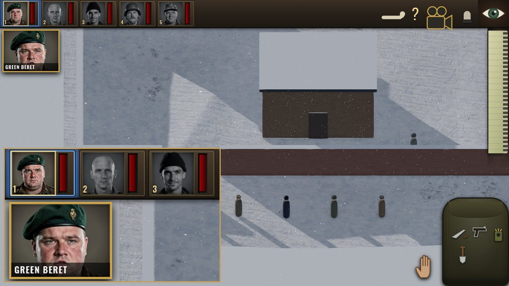
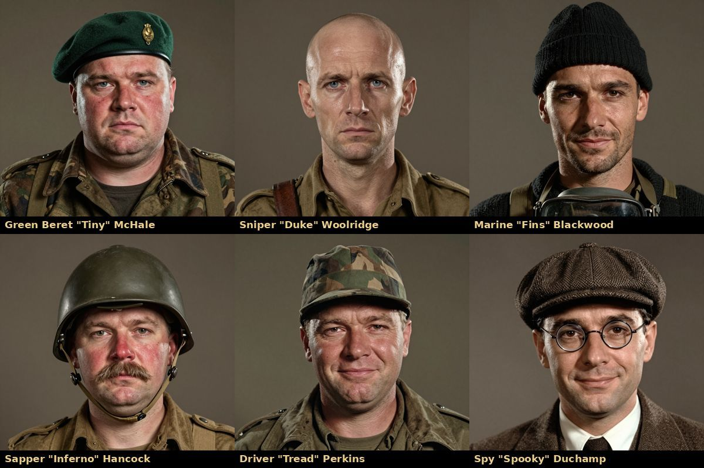
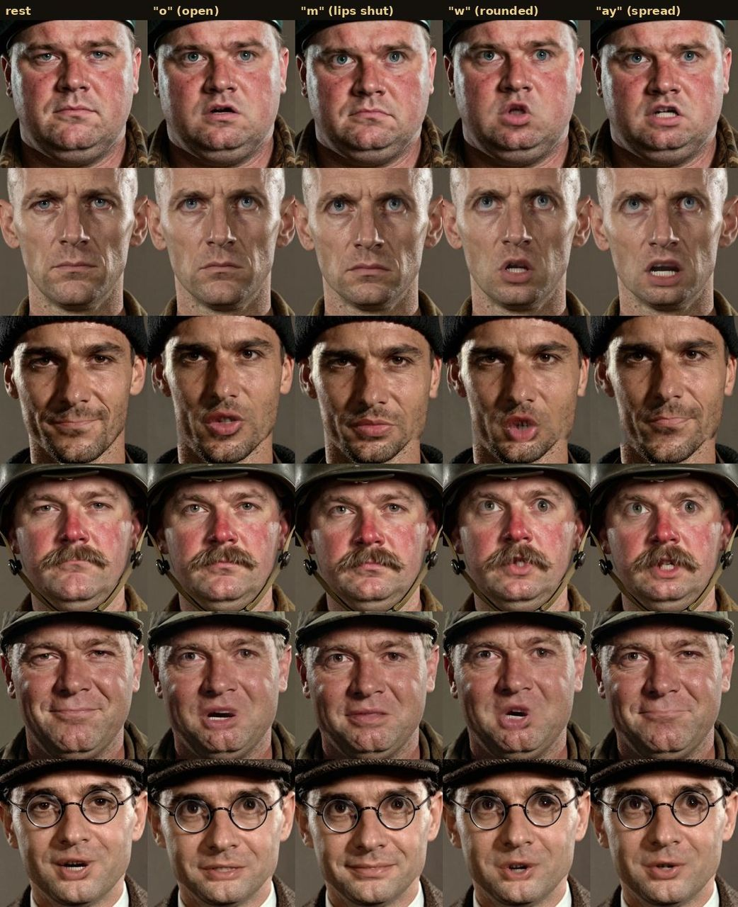
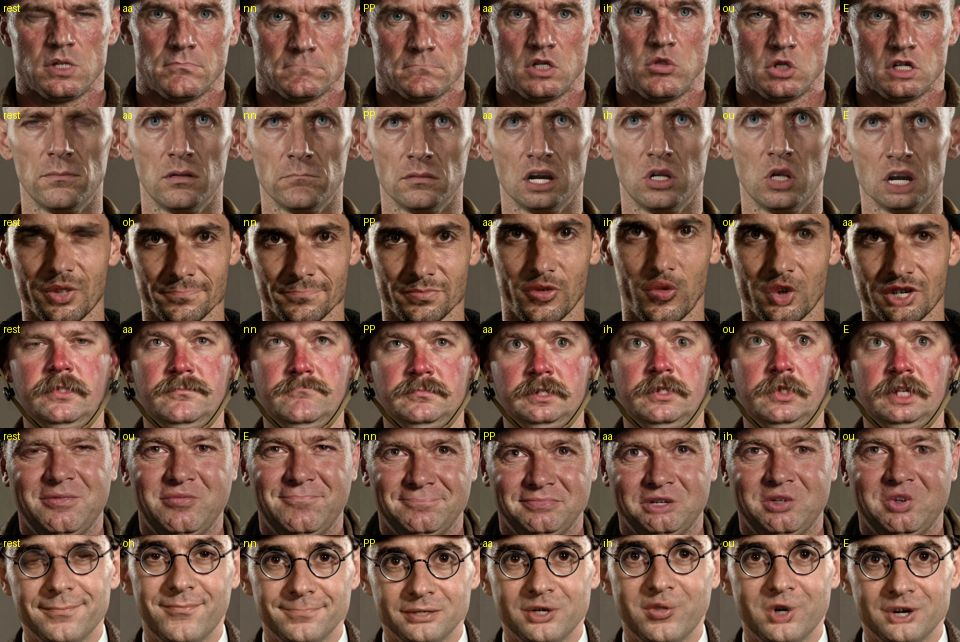
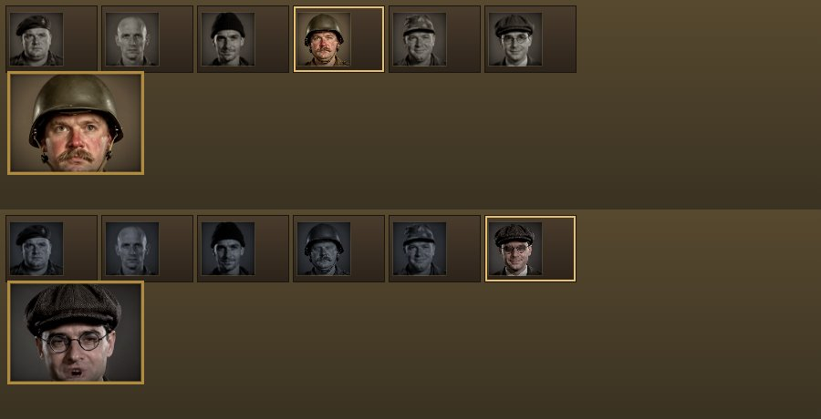
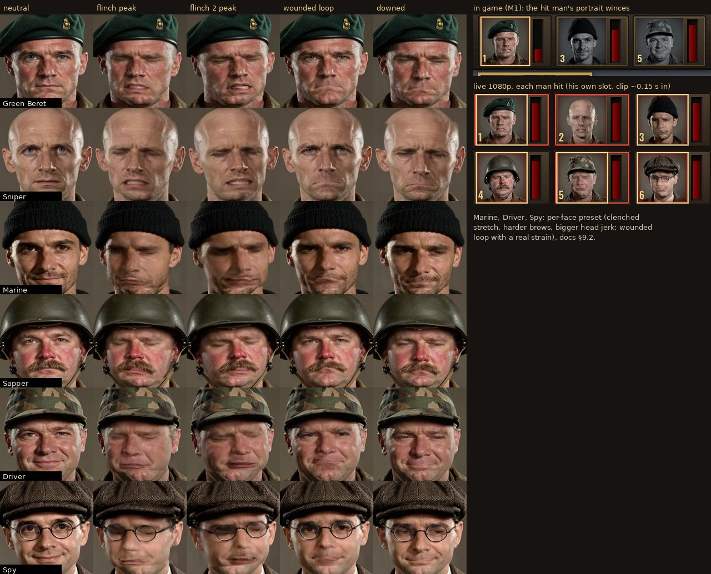

# Talking portraits

Status: final asset set rendered and validated on 2026-09-26. Supersedes the A/B comparison (`faces_judge` notes).
**Re-rendered from voices v2 on 2026-09-27** (§3.2): every line and urgent alt clip now lip-syncs to the audio the player hears.
**Pain** (2026-09-27, user request "faces should show pain when they get hit"): flinch clips, grimacing "I'm hit!", wounded idle, downed still (§9).
**Integrated in the game** (2026-09-26, "Art integration: portraits"): `src/ui/talking-portraits.js`, mounted by the HUD per mission; clips in `assets/portraits/`; see §4.0.





## 1. Decision

**Ship the pre-rendered neural clips (option A). Retire the real-time 3D head (option B) as a visual.**

- At HUD size, A looks like a filmed person. B looks like a 2010-era game character: one generic face for everyone, grey teeth, toy-like headgear.
- The user asked for extremely realistic graphics, which rules B out.
- A's weakness was flexibility: it only covers lines rendered in advance. That is cheap to fix, because a clip takes about 3 s to render and about 27 KB to store at 256 px.
- B's viseme and coarticulation model (`th-anim.js`) survives: it now runs offline to drive A's mouth shapes (§3).

B's code and notes stay archived outside the build.

| Criterion (0–10) | A neural (final) | B real-time |
|---|---|---|
| Photorealism | 8.5 | 3 |
| Lip-sync | 8 (real closures and rounding now) | 6 |
| Identity consistency | 9 (six clearly different men) | 4 |
| Runtime cost | 9 (one small video decode) | 6 |
| Flexibility | 5 (generic talk loop for unrendered lines) | 9 |

## 2. What ships

The asset root is `faces/final/clips/` in the scratchpad pipeline. It is meant to be copied to `assets/portraits/`.

```
manifest.json            characters -> lines/idle/talk_loop, per-clip key, lead, voice, sizes
licenses.json            components, licenses, credits line, synthetic-face policy
<char>/still_1024.jpg    full-resolution portrait (character select, briefing dossier)
<char>/<name>_{256,512}.{webm,mp4,jpg}   muted clip (VP9 / H.264) + poster frame
<char>/voice/<line>.{ogg,mp3}            the voice line each clip was rendered from
```

There are six characters: `green_beret`, `sniper`, `marine` (game role `diver`), `sapper`, `driver`, `spy`. Each character has:

- **8 voiced lines:** `yes_sir`, `what_now`, `ready`, `right_away`, `understood`, `on_my_way`, `consider_it_done`, `i_m_hit`. These are the 8 core lines of the voices v2 pack (`assets/audio/voice/<char>/primary/`; the pipeline reads their lossless masters, §3.2), so the set covers selection, acknowledgement and hurt.
- **`idle`:** a 4.28 s seamless loop with two blinks and natural head drift.
- **`talk_loop`:** a 3.9–4.8 s seamless loop of generic speech. It is the fallback for any line that has no rendered clip.

- **Urgent `alt` takes:** the audio pack also has an urgent take of each line (played for `hurt` and while the alarm is up). Its timing differs (for example the Sapper's "On my way." is 0.76 s urgent vs 1.21 s primary), so each alt take has its own clip, `lines.<line>.alt` in the manifest.

That makes 108 clips in total (48 lines + 48 alt takes + 12 loops).

Sizes (bytes on disk):

| Set | Count | Average per clip | Total |
|---|---|---|---|
| 256 px WebM (HUD) | 60 | 26.8 KB (17–73 KB) | 1.6 MB |
| 256 px MP4 (Safari) | 60 | 30.3 KB | 1.8 MB |
| 512 px WebM (character select) | 60 | 73 KB (48–196 KB) | 4.3 MB |
| 512 px MP4 | 60 | – | 5.5 MB |
| Voices OGG+MP3 | 48 | – | 0.67 MB |
| Stills 1024 JPG | 6 | ~150 KB | 0.9 MB |

The recommended HUD tier (256 px WebM+MP4, posters and voices) is about 4.7 MB. `*_raw.mp4`, `*.key` and `*.enc.json` are build intermediates; do not ship the raw files.

## 3. Quality work done in this pass (the must-fix list)

| # | Must-fix | Result |
|---|---|---|
| 1 | Full line set, re-runnable, hash-keyed, validation | `build.py` renders every voiced line (48 + 12 loops). Each job has a sha1 key of portrait + wav + viseme timing + params + `PIPE_VERSION`, and only changed jobs re-render. `lead` is written per line into `manifest.json`. `validate.py` exits 1 on any voiced line without a clip, and on stale keys or missing files. Current result: **0 problems**. |
| 2 | Mouth shapes | `visemes.py` ports `th-anim.js`: the dominance blend, the bilabial/labiodental override and the 85 ms lip lead. It produces five tracks (open, press, labio, round, spread). "open" drives LivePortrait's lip retargeting. The others become per-frame LivePortrait expression-keypoint deltas (`EXP_ADD` patch). JoyVASA's own lip motion is muted during closures (`LIP_JOY_T`). Mouth opening is calibrated per face (`calibrate.py`), and the Driver's gain rose from 0.42 to 0.87. |
| 3 | Full blinks | Blink = LivePortrait eye retarget plus a direct eyelid keypoint delta, ×1.0–1.8 per face, with an 80 ms hold (2 frames). All six faces close fully (checked frame by frame; see the limits in §3.1). |
| 4 | Idle loop seam | Smoothstep crossfade that reaches 1.0 on the last frame. The talk loop is cut inside its silent rest padding, at the frame with the least motion. Loops get more bits. Measured seam jump / median frame step: **idle 0.0–0.19, talk loop 0.04–0.48** (target ≤ 2; the previous pass was about 7). |
| 5 | Portrait accuracy | Regenerated at 1024 px with headroom. All headgear is fully in frame. The Green Beret was made heavy (about 110 kg, bull neck) in this pass; on 2026-09-27 his face was **slimmed at the user's request** (img2img from that still, so he stays the same man: square jaw, no jowls, leaner neck; see §5). The Sapper's helmet follows the character bible's decision: a domed Mk III-style helmet with a short brim, not the Brodie dish. |
| 6 | Break the "same face" | Prompts rewritten from `character-bible.md` §4 (apparent age, build, face shape, hair, facial hair, headgear, skin, eyes): gaunt bald Sniper, stubbled watch-cap Marine, moustached helmeted Sapper, jowly camo-cap Driver, bespectacled tweed-cap Spy. Seeds and prompts are in `portraits/final/seeds.json`. |
| 7 | Sync in game | Audio-clock seek plus `requestVideoFrameCallback` drift correction; `muted playsinline`; clips preloaded as blobs at mission load; WebM with MP4 fallback. Measured drift in headless Chromium: **−9 / +4 ms**. |
| 8 | HUD styling | CSS-only frame, vignette and grade over the baked studio background, with themes `desert` (warm), `night` (cool, darker), `snow`, `europe` and `none`. Readable at the 40 ref-px slot (60 px at 1080p) and in the 96×72 speaker card. |
| 9 | License bookkeeping | Licenses re-confirmed on the model cards on 2026-09-26 (§6). The policy line and the lookalike check are in `licenses.json`. No insignia issues: the Spy is in civilian tweed. |
| 10 | "Urgent" / "pain" variants | Urgent alt takes: §2. **Pain: done 2026-09-27** (flinch clips, grimacing "I'm hit!", wounded loop, downed still; §9). |

### 3.1 Objective metrics

Per-clip measurements are in `clips/metrics.json`, from `scripts/eval.py` using MediaPipe on the 768 px renders.

| Metric | Result |
|---|---|
| Phoneme sync: lip gap vs intended viseme opening (`corr_vis`) | median **0.94**; 47/48 at or above 0.7 |
| Audio-envelope correlation (`corr`) | median 0.73; 27/48 at or above 0.7 |
| Bilabial closure: lip gap at p/b/m ÷ 90th-percentile speech gap | median **0.024**, max 0.092 (pass ≤ 0.35) |
| Rounding contrast: mouthPucker on O/U/W minus on E/I/S | positive in 28/33 lines |
| Loop seams (jump ÷ median step) | idle ≤ 0.19, talk loop ≤ 0.48 |

Limits of these measurements:

- **`corr` is expected to fall.** It penalises correct behaviour: the lips are shut during voiced /m n/, which have a high audio level (for example "on my **w**ay", "I'**m** hit"). Short shouts barely move the jaw. `corr_vis` is the sync check that matters.
- **The Sapper's moustache hides his lip gap from MediaPipe.** That is why his "Understood" scores `corr_vis` 0.54.
- **MediaPipe cannot confirm full blinks.** Its eye-aperture landmarks bottom out at 0.2–0.45 of the open value even on a shut lid. Blink closure was therefore verified visually on all six faces.
- **Closed-lid frames are slightly soft.** This is a LivePortrait warp artefact. It lasts about 3 frames and is not visible at HUD size.



### 3.2 Source audio = voices v2 (re-render, 2026-09-27)

Voices v2 (commit 1b11745: a distinct voice per commando, French-accented Spy) replaced the audio pack, but the clips above had been rendered from the v1 voices, so the mouths no longer matched what the player hears. All 102 audio-driven clips were re-rendered from the v2 audio: 48 lines, 48 urgent alt takes and the 6 `talk_loop`s (built from v2 lines). The 6 `idle` loops are silent, so their keys did not change and they were not re-rendered. The Green Beret uses the slimmed face.

- **Source:** `build.py` `VO` = `voices2/portrait_src/<char>/{primary,alt}/<line>.*` in the scratchpad, a folder of links. The `.wav` is the lossless 48 kHz PCM master (`voices2/work/master/`), which is exactly what the shipped Opus/MP3 were encoded from. The `.json` (text, word/phone/viseme timing, duration) and `.ogg`/`.mp3` come from `voices2/pack/`, which is byte-identical to `assets/audio/voice/` (the manifest voice paths still point there). v1 was `voices/final/`.
- **Keys:** every line/alt/loop key changed (new wav + viseme timing); `validate.py`: **0 problems**. Clip durations follow the v2 takes (for example the Sniper's "Yes, sir!" is 1.28 s, v1 was 1.13 s).
- **Metrics:** `eval.py` now also scores the alt takes. `corr_vis` = lip gap vs the v2 viseme opening track (the phoneme-sync metric, §3.1):

| Character | v1 clips vs v1 audio (lines) | v1 clips vs **v2** audio (lines, the mismatch) | **v2 clips** lines median (min) | v2 alt takes median (min) |
|---|---|---|---|---|
| Green Beret | 0.884 | 0.892 | **0.915** (0.828) | 0.903 (0.761) |
| Sniper | 0.949 | 0.871 | **0.959** (0.875) | 0.933 (0.858) |
| Marine | 0.925 | 0.916 | **0.907** (0.840) | 0.889 (0.721) |
| Sapper | 0.917 | 0.917 | **0.889** (0.665) | 0.838 (0.722) |
| Driver | 0.932 | 0.916 | **0.905** (0.797) | 0.921 (0.829) |
| Spy | 0.966 | 0.600 | **0.966** (0.868) | 0.962 (0.934) |

Every character is at or above its v1 median or within 0.05 of it (worst Sapper −0.028, moustache; Driver −0.027). The mismatch column is only moderate for the four characters whose v2 lines keep a similar rhythm; it collapses for the Spy (new French accent and timing) and drops for the Sniper. It also understates the problem, because a v1 clip ends before a longer v2 take does. Bilabial closure (median lip gap at p/b/m ÷ speech gap) stays at 0.016–0.055 for lines and 0.010–0.061 for alt takes (pass ≤ 0.35). Checked by eye: mouths open on the vowels and shut on the /m/ of "on **m**y way" for all six (`mouth_sheet.py`), and the 80 ms blink hold closes the lids (frames 3–6 of each line).



## 4. Integration: the drop-in HUD module

### 4.0 As integrated in the game

- **Assets:** `python3 tools/portraits/sync_assets.py` copies the HUD tier (256 px WebM + MP4 + poster per clip; 108 clips, about 7.0 MB; with the pain set of §9: 132 clips, 8.81 MB) from the pipeline's `clips/` into `assets/portraits/`, with `manifest.json` (`sizes: [256]`) and `LICENSES.json`. The voices are not duplicated. The audio pack `assets/audio/voice/<char>/{primary,alt}/` has byte-identical files (checked by hash), so the manifest's voice paths point there (`../audio/voice/...`). The 512 px tier and the 1024 stills stay in the pipeline.
- **Module:** `src/ui/talking-portraits.js` is the module below, with these changes:
  - **Clip choice:** it reads the `rec` and `take` stamps that the audio system puts on the bark, instead of matching text. Text matching is the fallback.
  - **Alt takes:** it plays `alt` clips.
  - **Silent lines:** a voiced speaker's unrecorded lines ("Aye?", "Can't do that one, sir.") get no talk loop, because the audio pack keeps them silent. They show a subtitle and the still. Placeholder voices, with no pack, still get the talk loop.
  - **Line timing:** each line keeps the clock it started on. A wall-clock safety timer ends a line even if the video stalls.
  - **Death:** a death stops that man's line.
- **HUD:** `HUD.onMissionLoaded → _mountPortraits` creates it after `topbar.build` and sets `hud.portraits` and `hud.portraitsReady`. It is disposed on the next mission or on `HUD.dispose`. `options.talkingPortraits = false` turns it off.
- **Stills:** `TalkingPortraits.probe()` runs once, when the HUD is constructed. It registers the posters with `art/portraits.js` (`registerPortraitPhoto`), so the briefing, knapsack, top bar and speaker card show the photo stills even when the clips cannot play. The procedural canvas portrait remains the last fallback.
- **Styling:**
  - `.tp-on` on the HUD root retires the placeholder mouths.
  - The name strip on the speaker card stays above the clip.
  - Stills and clips share the theater grade from `themeFor(def)`: snow, desert, europe, or night when the sun is below the horizon.
  - Unselected portraits are greyscale and the selected one is in colour (character bible [HUD]).
- **Selection / order lines** (`src/audio/voice-lines.js`): `select` has no chance roll: a man always answers. His first answer is "Yes, sir!", then the director rotates round-robin through his recorded selection lines (never the same line twice in a row). Anti-spam: re-selecting the man who answered last within 3 s stays quiet; a different man always answers, replacing the previous answer at once (`newMan`). Orders use `ack_move` / `ack_act` (0.8 s per man). In own-voice mode `nextLine()` and `ownVoiceGate()` apply the same rules.
- **Tests:**
  - `tests/unit/talking-portraits.test.mjs`: coverage of every recorded take, voice paths, budget, clip choice, grade and fallback; own-voice rotation and cooldowns.
  - `tests/unit/audio.test.mjs`: the `select` rule (always answers, "Yes, sir!" first, rotation, 3 s re-selection cooldown, a new man always answers, group → leader).
  - `tests/portraits-talk.test.mjs` (GPU, M1, real keys and clicks): key 1 → the Green Beret's top-left portrait plays his selection clip within 200 ms (measured about 80 ms) and its time advances, the voice plays, the portrait is in colour; portrait click, world click (next line), move order (ack line), rapid re-selection, group, muted voice, reduced motion, 4K.
  - `tests/portraits.test.mjs` (GPU): M1–M3. It checks the mount, the photo stills, idle and grey states, the exact recorded clip in the man's portrait (card mirror), drift against the AudioContext clock (−10 to −16 ms), line end, the alt clip, death, frame cost and the missing-manifest fallback.

The module is `faces/final/hud/talking-portraits.js`. Copy it to `src/ui/talking-portraits.js`. It has no dependencies; three.js is only needed for `videoTexture()`.

```js
import { TalkingPortraits } from './talking-portraits.js';
// at mission load (after the HUD has built its portrait row)
const tp = new TalkingPortraits({ events: game.events, hud: game.hud, audio: game.audio, base: 'assets/portraits/', size: 256 });
await tp.load(world.commandos);            // manifest + preload/decode every clip of these commandos
tp.setTheme(mission.theme);                // 'desert' | 'night' | 'snow' | 'europe' | null
// on mission end
tp.dispose();
```

### 4.1 Where the video goes

- **DOM `<video>` elements, not `renderer.overlayScene`.** The HUD is DOM. The overlay scene is drawn with the *world* orthographic camera, so it is not a screen-space layer. Browser-composited video also never passes through the renderer's ACES OutputPass, so there is no double tone mapping. The GPU cost in the three.js frame is zero.
- **Idle loop:** a host `div.tp-host` goes into `hud.portraitSlot(unit.id)`, which is the §6.3 cross-team hook. Only the first selected commando's idle loop plays. The other portraits show their first frame, greyscaled by the same `.hud-portrait:not(.selected)` rule as the static face.
- **Lines (2026-09-27, "HUD: top-left portrait talks on select/order"):** every line plays **in the speaker's own top-left portrait** (the slot's second `<video>`), over his idle loop. While the HUD shows the speaker card (`hud.topbar.card`, 96×72 ref px, object-position 50% 28%), the card mirrors the same clip, kept on the same audio clock. The card alone is used only for a speaker without a slot (a guest, or a dead man's death line). The portrait gets `.tp-talking` while he speaks, so it is in colour even when he is not the selected man; then the line fades back to his idle loop (selected) or still. At most three small videos decode at once: one idle, the line and its card mirror.
- **Before this change** lines played only in the speaker card, so the top-left portrait never moved its mouth; and the `select` rule (70 % chance, 6 s per-man cooldown) left most selections silent.
- **Reduced motion** (menu kit `reducedMotion`, or the OS setting): no idle loop and no line clip; the photo still stays while the voice plays.
- **Muted voice:** the clip still plays (the bark still fires; only the voice bus is silent), so the mouth moves.
- **CSS:** the module injects one style tag. `.hud-portrait-slot{z-index:0}` and the skull/glyph at `z-index:1` keep the death skull and state glyph above the video.

### 4.2 Events and clip choice

| Event | Behaviour |
|---|---|
| `unit:selected` | The selected commando's idle loop comes alive. The audio system answers with a `select` bark (below): the leader only for a group. |
| `bark` (from `audio.say` for `select` / `ack_move` / `ack_act` / `hurt` / …, or from any system) | The module reads the bark in a microtask, after the audio system has stamped `text` and `duration`. If `text` matches a rendered line, it plays that clip, seeked to its `lead`, so the mouth matches the voice that is starting now. Otherwise it plays the character's `talk_loop` for `duration` and fades back to idle. Enemy barks are ignored. |
| `unit:order`, `unit:selected` in own-voice mode (no `audio` passed) | The module picks a rendered line for the key itself (`KEY_LINES`: select → yes_sir / ready / what_now; ack_move → on_my_way / right_away / understood; ack_act → consider_it_done; hurt → i_m_hit) and plays the OGG (MP3 on Safari) on its own `AudioContext`, 120 ms after the clip, so the lips move just before the sound. |
| `unit:killed` | That portrait's host is hidden, so the HUD skull shows. |

### 4.3 Sync

- The audio clock is `AudioContext.currentTime`: the module's own context in own-voice mode, otherwise `audio.engine.ctx` or `audio.ctx`, falling back to `performance.now()`.
- The expected clip time is `lead + (now − voiceOnset)`.
- Each `requestVideoFrameCallback` compares the clip to that expected time. A drift above 30 ms seeks, to 10 ms past the expected time (`SEEK_AHEAD`: a seek lands a decode later), at most once per 250 ms per video so that a seek can land. A drift between 15 and 30 ms nudges `playbackRate` within 0.92–1.08.
- Why 30 ms (2026-09-27): `play()` resolves 15–96 ms after the voice starts. With the old 100 ms seek threshold, the rate nudge needed 0.5–1 s, most of a short line, to catch up (Sniper order −90 ms, Spy order −96 ms, Sapper −61/−63 ms). A 40 ms threshold still left one start at −41…−29 ms for 250 ms (Driver select). Measured with 30 ms (live probe `scratchpad/pv2/run-probe.mjs`, M2 + M3, select and order for each man, 10 lines): the first sampled frame is −26…+11 ms from the audio clock. Nine lines hold −5…+15 ms from there on. The tenth (Driver order) starts at −26 ms, under the seek threshold, and the rate nudge then holds it between −24 and −6 ms, closing in over the line.
- The line ends at `voice_seconds + 0.3 s`, and the clip then fades out over the idle loop in 120 ms.

### 4.4 Wiring the recorded lines into the game's audio

The game's `LINES` texts ("Aye?", "Woolridge.", …) are not voiced yet. Today `audio.say` synthesises placeholders, so every commando line falls back to `talk_loop`, which is correct but generic. There are two ways to get exact lip-sync:

- **Register the rendered lines as variants.** Add `assets/audio/voice/lines.json` entries `{speaker, key, n, text, file}` that point at `<char>/voice/<line>.ogg`, and add the same texts to `LINES`. The bark text then matches and the exact clip plays.
- **Voice the game's own `LINES` with the voice pipeline** (v2: `voices2/work/master/<char>/<take>/<id>.wav` + `voices2/pack/.../<id>.json`, linked into `voices2/portrait_src/<char>/<take>/`), then run `python build.py`. Only the new lines render, at about 3 s each; for example, the ~130 commando lines in `voice-lines.js` take about 7 minutes. Then run `validate.py`.

### 4.5 Fallback

Any of these leaves the HUD exactly as it is (static face plus placeholder mouth): `load()` resolves `false`, a codec is unsupported, autoplay is rejected, or a clip fails to load. This was tested: a missing manifest gives `ok:false` and zero attached hosts.

### 4.6 3D use

`videoTexture(THREE, url)` returns an sRGB `THREE.VideoTexture` on a muted looping video. Use it for the character-select table or a briefing prop, with 512 px clips. If you draw it in `renderer.overlayScene`, it comes after the OutputPass, so ACES is not applied twice.

### 4.7 Test bench

`faces/final/web/index.html` is a HUD replica with the real `.hud-portrait` / `.hud-portrait-slot` / speaker-card DOM. `web/check.mjs` drives it in headless GPU Chromium. Last run:

- loaded webm
- idle playing, others paused
- line drift +4 ms
- line ended on time
- talk loop for an unrecorded line, ended on time
- fallback OK



*Top: desert grade, the Sapper acknowledging an order. Bottom: night grade, the Spy on the generic talk loop.*

## 5. Regeneration

The pipeline is in the scratchpad at `faces/final/scripts/`. It reuses `faces/neural/` (venv, JoyVASA/LivePortrait repo, weights), all on an RTX 5090. The whole set takes about 5 minutes to render and about 4 minutes to encode.

| Step | Command | Notes |
|---|---|---|
| Portraits | `SEEDS=101,202,303,404 python gen_portraits.py ../portraits/cand` | Z-Image-Turbo Q4_K_M GGUF, 9 steps, cfg 0, 1024², about 5 s per image. Prompts are in `prompts.py`. |
| Pick | `python finalize.py ../portraits/cand driver=606 green_beret=606 marine=101 sapper=202 sniper=202 spy=101` | Writes `<char>.png` (1024 still) and `<char>_src.png` (768 head-and-shoulders crop that drives the animation), and records seed and prompt in `seeds.json`. |
| Slim Green Beret (2026-09-27) | `I2I=<old green_beret.png> STRENGTHS=0.75 SEEDS=606 VARIANTS=c python gen_slim_gb.py OUT`, then `FIX_S='{"green_beret": 818}' python finalize.py OUT green_beret=606` | User request: slimmer face in the top-left portrait. Same model and settings, img2img at strength 0.75 from the previous heavy still so identity, lighting and framing hold; the crop side is pinned to the old 818 px so the slimmer face is not re-zoomed. Picked by eye from 34 candidates (plain txt2img 'lean' prompts drifted to a generic model face). Face width/height 0.93 → 0.90, jaw 0.92 → 0.87 (MediaPipe). Before/after: `screenshots/portrait-gb-slimmer.jpg`. |
| Calibrate | `python calibrate.py 2` | Per-face `open_max` toward a vowel lip gap of 0.06 of face height. Blink gains are in `clips/calib.json`. |
| Render | `python build.py [--only spy] [--force]` | Hash-keyed: renders only new or changed lines, including the urgent `<VO>/<char>/alt/` takes (VO = `voices2/portrait_src`, §3.2) (`<line>_alt` clips). JoyVASA motion + LivePortrait + viseme shapes + blinks, then `encode.py` (512/256, WebM VP9 CRF 33/28/31 for line/idle/loop, H.264 CRF 23, posters), then `manifest.json`. |
| Check | `python validate.py` | Exits 1 on any voiced line or urgent alt take without a clip, or on stale or missing files. |
| Ship | `python3 tools/portraits/sync_assets.py` (repo) | Copies the 256 px tier into `assets/portraits/` (§4.0). |
| Pain (2026-09-27) | `python pain_calib.py OUT chars units` (calibration renders), then `build.py` (flinch / wounded / downed jobs, §9), `python pain_sheet.py OUT.jpg HUD.png` | Preset in `pain.py` + `visemes.EXP_DIRS`; per-face overrides by mode in `build.PAIN_GAIN`, calibrated on real jobs with `python pfix_calib.py OUT JSON` (§9.2). |
| Metrics | `python eval.py` | Writes `metrics.json`. `mouth_sheet.py LINE out.jpg` and `showcase.py DIR` make contact sheets. |

Patches in the vendored JoyVASA copy (`repos/JoyVASA/src/live_portrait_wmg_pipeline.py`; original saved as `.bak_final`):

- `VISEME_OPEN` (lip retarget)
- `EXP_ADD` (per-frame expression-keypoint deltas)
- `LIP_JOY` / `LIP_JOY_T` (JoyVASA lip residual, muted in closures)
- `EYE_CLOSE` / `EYE_GAIN` (blinks)
- `POSE_ADD` / `T_ADD` (per-frame head rotation in degrees and translation: the pain flinch jerk and the wounded breathing, §9); backup `.bak_prepain`
- MediaPipe in place of InsightFace

Keypoint directions are in `visemes.py:EXP_DIRS`. They were calibrated with `calib/jobs*.json`: round raises MediaPipe mouthPucker by 0.6, and spread widens the mouth by 9 %.

## 6. Licenses

Everything is redistributable. Full detail is in `clips/licenses.json`. Copy it to `docs/` and the credits screen.

| Component | Role | License |
|---|---|---|
| Z-Image-Turbo (Tongyi-MAI), unsloth GGUF Q4_K_M | portrait text-to-image | Apache-2.0 |
| Qwen3-4B (unsloth GGUF) | text encoder | Apache-2.0 |
| JoyVASA (jdh-algo) | audio → head/face motion | MIT |
| chinese-hubert-base (TencentGameMate) | audio features for JoyVASA | MIT (model card re-checked 2026-09-26) |
| LivePortrait (KwaiVGI / KlingTeam) | portrait animation renderer | MIT |
| MediaPipe FaceLandmarker | face crop and landmarks (replaces InsightFace, which is non-commercial) | Apache-2.0 |
| Kokoro-82M / Chatterbox-Multilingual | voices (Spy = Chatterbox) | Apache-2.0 / MIT |
| ffmpeg | encoding tool only | outputs unencumbered |

- **Excluded on purpose (non-commercial):** InsightFace weights, Wav2Lip, SadTalker/BFM, Sonic, FLOAT.
- **Policy:** synthetic faces, no real-person input. The portraits come from written descriptions only (seeds and prompts are in the repo), and no photo, likeness or voice of a real person was used. Before release, run a lookalike check (reverse image search of the six stills). Keep checking every uniform for Nazi insignia; there are none in this set.
- **Credits line:** "Talking portraits AI-generated with Z-Image-Turbo (Apache-2.0), JoyVASA and chinese-hubert-base (MIT), LivePortrait (MIT) and MediaPipe (Apache-2.0); voices AI-generated with Kokoro-82M (Apache-2.0) and Chatterbox (MIT)."

## 7. Runtime cost

- **Decoding:** one 256 px VP9 idle decode, plus one line decode while a man speaks.
- **Memory:** about 300 KB of blobs per commando.
- **Renderer:** no shader programs and no render-pass cost.
- **Load:** preload is a handful of 20–70 KB fetches at mission load.

## 8. Open items

1. **Voice the game's actual `LINES`** so that every bark gets an exact clip instead of the generic loop (§4.4). The pipeline is ready. As integrated, every *voiced* line in the game has its exact clip: the 8 recorded lines × primary + alt. The flavour lines are subtitle-only until the audio track voices them; then `build.py` renders only the new ones.
2. ~~**"Urgent" and "pain" expression variants**~~ Pain: done (§9). Still open: a stronger JoyVASA `cfg` for alarm lines.
3. **Spy disguise variant** (German officer's cap, no swastika) for missions where he wears the uniform. It needs an img2img pass on his still and the same seed.
4. **Closed-lid softness** (a LivePortrait limit). If it ever shows at 512 px, add a two-frame lid-texture blend.
5. **Lookalike check** on the six stills before release.

## 9. Pain (2026-09-27)

User request: *"Faces should show pain when they get hit"* (the top-left HUD portraits). The six faces and their identities are unchanged (the Green Beret keeps the slimmed face). No new identity was generated: everything below is the same `*_src.png` portraits driven through the existing JoyVASA + LivePortrait pipeline with a pain expression preset.



### 9.1 What was rendered (per commando)

| Asset | Source | Result |
|---|---|---|
| `flinch_1..3` | one per recorded v2 grunt `assets/audio/voice/<char>/pain/pain_hit_{1,2,3}` (his own voice; the Spy's are his French-accented v2 voice) | 0.84–1.2 s clip (grunt + 0.06 s lead + 0.18 s tail): wince from clip time 0.02 s, peak at 0.1–0.25 s, partial recovery (32 % of peak) by the end; mouth driven by the grunt's viseme timing at 55 % opening, so the teeth stay clenched (the Marine, Driver and Spy: a clenched lip stretch at 40–45 %, harder brows and a bigger head jerk, §9.2). 256 px WebM 14–26 KB. |
| `i_m_hit` + `i_m_hit_alt` | the same v2 takes as before | re-rendered with the `line` preset: he winces while he says it (brows down and together, squint, a little frown and snarl). The upper face carries the pain and the mouth units stay small, so the lips keep following the visemes (§9.4). |
| `wounded` | silent, 4.28 s | seamless loop: strained face (brows down, lids tight, lips pressed, corners down; much stronger for the Marine, Driver and Spy, whose smiling neutral faces otherwise hid it), heavier breathing (3 breaths per loop: head rises and dips 1.1°, small vertical bob), one small wince at 2.35 s. Seam ratio 0.85–1.17 (target ≤ 2). 31–58 KB. |
| `downed_{size}.jpg` | 1.6 s silent render, frame 1.2 s | eyes half-closed, pained, head slumped 4° and tilted 4°. For the DOWNED state (feat/bodies buddy rescue). |
| `pain_{size}.jpg` | peak frame of `flinch_1` | the reduced-motion stand-in for a flinch. |

The v2 audio pack already had non-verbal grunts for every man (`pain_hit_1..3`, `pain_breath_loop`, `pain_death`, recorded with each man's v2 voice settings), so no new audio was synthesised. The breath loop and death gasp are not used by the portraits.

HUD tier after `sync_assets.py`: 132 clips, 8.81 MB (`assets/portraits` 9.2 MB, budget 10 MB); the pain set adds about 1.9 MB.

### 9.2 The pain preset (pipeline)

- **Units** (`visemes.py:EXP_DIRS`, LivePortrait expression-keypoint deltas; directions from the community expression editor's eyebrow < 0 / eyes / smile < 0 / eee sliders, magnitudes calibrated by eye with `scripts/pain_calib.py` on `calib/pain*`):
  - `brow`: brows down and together (kp 1, 2).
  - `squint`: lids squeezed (exp only).
  - `grimace`: lips stretched, teeth bared.
  - `frown`: mouth corners down (`frown` × 1.3 for the Spy, whose neutral face smiles).
  - `clench` (added 2026-09-27, see below): the `grimace`'s lateral lip stretch without its smile part.
  - `snarl`: upper lip up, a hint of nose wrinkle.
  - `tight`: lips pressed thin (wounded).
  - `lids`: heavy lids (downed).
- **Per-face overrides** (`build.PAIN_GAIN`, by mode). A verifier found the Marine, Driver and Spy much milder than the Green Beret and Sniper at HUD slot size (~75 px): the Marine's smirk stayed at the mouth corners (a squint or wink, not a wince), the Driver's open grunt over his smiling face read almost as laughing, and the Spy's round glasses hid the squeezed eyes (his flinch read as talking). Fixes, calibrated on real flinch / wounded / "I'm hit!" jobs with `scripts/pfix_calib.py` (`calib/pf2`–`pf8`):
  - More `frown` on top of `grimace` does not help. The two units pull the same keypoints (kp 14 and kp 20, y) in opposite directions, so the mix turns into a closed-mouth pout. The `grimace` itself is the community "eee" slider, which shares those smile components, so on a face that already smiles a strong `grimace` reads as a grin. Hence the new `clench` unit: kp 20 z stretch, corners slightly down, upper lip up.
  - **Flinch** for these three: `clench` 1.8 (Driver 1.5) instead of `grimace`, `snarl` 2.4, `brow` 2.2 (Spy 2.4: above the glasses the brows carry it), `squint` 1.1, eye retarget 0.22, mouth 45 % open (Driver 40 %), and a bigger head jerk (yaw 11°, Spy 12°; pitch 4.5°, roll 5°).
  - **"I'm hit!"**: `brow` 2.0, `squint` 0.9, eye 0.2; the mouth units stay small (`frown` 0.45, `snarl` 0.3, `grimace` 0.1). Stronger mouth units wrecked the lip sync (`corr_vis` 0.89 → 0.34 for the Marine in calibration).
  - **Wounded**: `brow` 2.4, `frown` 2.0, `tight` 1.2, `snarl` 1.8, `clench` 0.5, `squint` 0.8, eye 0.1. A `squint` above 1 smears the lids at the loop's wince.
  - Measured on the shipped 256 px clips (MediaPipe, `scratchpad/pv2/painmeas.py`): `mouthSmile` is 0 at every flinch and through every wounded loop, against a neutral 0.37 for the Spy and 0.19 for the Driver. Eye aperture at the flinch peak, as a share of neutral: Driver 0.16–0.18, Spy 0.21–0.27 (behind the glasses), Marine 0.26–0.34 (Green Beret 0.16–0.19). The Marine's lids are shut in the frames, but his deep-set eyes go soft under the lowered brows and MediaPipe does not see them close fully. More eye retarget (0.3) or the `lids` unit did not change that measure (0.29–0.38).
  - The Green Beret, Sniper and Sapper keep the base preset. Their pain jobs re-rendered only because the preset files are part of the key; their spec did not change.
- **Pose:** two new pipeline hooks next to `EXP_ADD`: `POSE_ADD` (per-frame pitch / yaw / roll in degrees, composed onto `R_new`) and `T_ADD` (translation). The flinch jerk turns the head 7° away (alternating sides per variant), tucks the chin 3° and rolls 3.5°, then springs back to 20 % of that.
- **Envelopes** (`scripts/pain.py`): `flinch` (0.08 s smoothstep rise, 0.14 s hold, 0.22 s decay to 32 %), `line` (hit, then a sustained 62 % wince while speaking), `wounded` (periodic, so the loop is seamless), `downed` (constant).
- **Eye retarget:** the extra eye retarget stays at 0.22 or below while `squint` is active. Higher values plus the squint keypoints smear the lids.
- **Frame 0 stays neutral.** LivePortrait's expression-friendly relative motion subtracts frame 0 from every frame, so a delta already present at frame 0 cancels out. The first version of the wounded loop looked neutral for that reason.
- **Build:** `build.py` adds `pain_jobs()`: 3 flinches, the wounded loop and the downed still per man. `i_m_hit` and its alt take get `pain={mode:'line'}`. Pain job keys also hash `pain.py` and `visemes.py`, so retuning the preset re-renders only these jobs. `validate.py` checks:
  - one flinch per recorded grunt;
  - the wounded seam (≤ 2);
  - stale keys;
  - the stills.

  Result: **0 problems**. Manifest: `characters.<c>.pain = {flinch:[{clip, rec, lead, voice_seconds, voice}], wounded:{clip, loop}, still, downed}`.
- The v2 lip sync of the other lines is untouched: their keys did not change, so they were not re-rendered.

### 9.3 In the game

- **Audio** (`src/audio/event-map.js`, `voice-lines.js`):
  - On `unit:damaged` for a living commando, the audio system says `pain`: a non-verbal line with the three recorded grunts, rule `{cd: 0.4, prio: 5, sub: false}`. It cuts a playing select/ack line at once (prio 5 > 1–4).
  - When the grunt is over (`audio.after(grunt duration)`), it asks for `hurt` ("I'm hit!", the existing 1.5 s cooldown). The two never overlap.
  - A hit inside the grunt's 0.4 s cooldown adds nothing, so there is no restart every frame.
  - Enemies are unchanged (`ger_hurt`).
- **Portraits** (`src/ui/talking-portraits.js`):
  - **Flinch:**
    - The module subscribes to `unit:damaged` and reacts in a microtask, after the audio system has picked the grunt. It plays the flinch rendered from that same grunt (`pickFlinch`), from frame 0, in **his own** top-left slot.
    - It interrupts any line, in colour (`tp-talking`), with a 0.45 s red inset pulse on the slot (`tp-hit`).
    - Hits inside 0.4 s of the last flinch do not restart it (`flinchGate`).
    - The `pain` bark itself plays no line clip. The following `hurt` bark plays the grimacing `i_m_hit` clip as before.
  - **Wounded:**
    - Below 50 % hp (`painState`), his idle clip is the wounded loop.
    - It is still only the selected man's idle that plays. The others show its first frame (strained, greyscale), and the static face under the slot follows.
    - It is re-checked on `unit:damaged`, `ability:end` (first aid) and `unit:revived`.
  - **Downed:** the `unit:downed` / `unit:revived` events from feat/bodies (buddy rescue) are subscribed to, and `unit.downed` / `state === 'downed'` are read. A downed man shows the downed still and does not flinch. Without feat/bodies these events never fire. **Death** keeps the skull (unchanged).
  - **Reduced motion:** the `pain_{size}.jpg` still, in colour, for 0.7 s instead of the video. The pulse is static.
  - **Muted voice:** the face still reacts, because the flinch is driven by the damage event, not the voice.
  - **Budget:** unchanged. A flinch uses the slot's line video (plus the speaker-card mirror when shown), and the wounded loop replaces the idle. At most 3 videos decode (measured: 3).
  - **No combat code was touched.** Only existing events are subscribed to (`unit:damaged`, `unit:killed`, `ability:end`), plus the feat/bodies ones.
- **Tests:**
  - `tests/unit/portraits-pain.test.mjs`:
    - assets: ≥ 2 flinches per man from his own grunts, wounded seam, stills;
    - `painState`, `flinchGate` and `pickFlinch`;
    - the flinch in his slot interrupting another man's select line, with the variant of the heard grunt, the pulse, no restart within 0.4 s, and another variant after it;
    - the wounded loop, and back after first aid;
    - downed, and revived;
    - the reduced-motion still.
  - `tests/unit/audio.test.mjs`: the grunt first, then `hurt` after it.
  - `tests/portraits-pain.test.mjs` (GPU, M1, real game):
    - a hit shows the flinch in the hit man's portrait in **35–101 ms** (limit 150 ms), in colour, with the pulse and 3 videos decoding;
    - 5 more hits in 0.3 s do not restart it;
    - voice log: one grunt, and "I'm hit!" only after the grunt ended, with no overlap;
    - below 50 % the selected man's idle is the wounded loop and plays;
    - muted voice still flinches;
    - reduced motion shows the still;
    - 4K.

### 9.4 Lip sync of the grimacing "I'm hit!"

`eval.py` (the §3.1 metrics) on the re-rendered takes. A first preset that also grimaced with the mouth cut the speech opening in half: the Green Beret's `corr_vis` fell 0.92 → 0.65. The mouth units were therefore reduced for `line` (grimace 0.12, frown 0.25, snarl 0.2), and the Spy's frown boost became a multiplier. Final values:

| `corr_vis` (before the pain preset → first pain preset → per-face overrides, 2026-09-27) | `i_m_hit` | `i_m_hit_alt` |
|---|---|---|
| Green Beret | 0.924 → 0.890 → 0.885 | 0.909 → 0.839 → 0.838 |
| Sniper | 0.970 → 0.968 → 0.966 | 0.930 → 0.912 → 0.913 |
| Marine | 0.901 → 0.882 → 0.881 | 0.914 → 0.893 → 0.892 |
| Sapper | 0.880 → 0.870 → 0.872 | 0.822 → 0.756 → 0.837 (moustache, §3.1) |
| Driver | 0.964 → 0.923 → 0.884 | 0.955 → 0.937 → 0.899 |
| Spy | 0.973 → 0.979 → 0.959 | 0.963 → 0.935 → 0.923 |

- The Green Beret, Sniper and Sapper specs did not change in the last step; their small differences are re-render noise (the Sapper's alt take moved up).
- Bilabial closure on the /m/ of "I'**m**" stays within the pass limit (≤ 0.35) for all 12 takes: max 0.308 (Marine), median 0.07. The Marine keeps the old mouth units for this line: with `frown` 0.45 his closure went to 0.397.
- The set median `corr_vis` over every line and alt take is 0.919.
- The flinch clips are not lip-sync scored: the grunts are non-verbal, and their mouths follow the grunt's envelope at 55 % opening.
